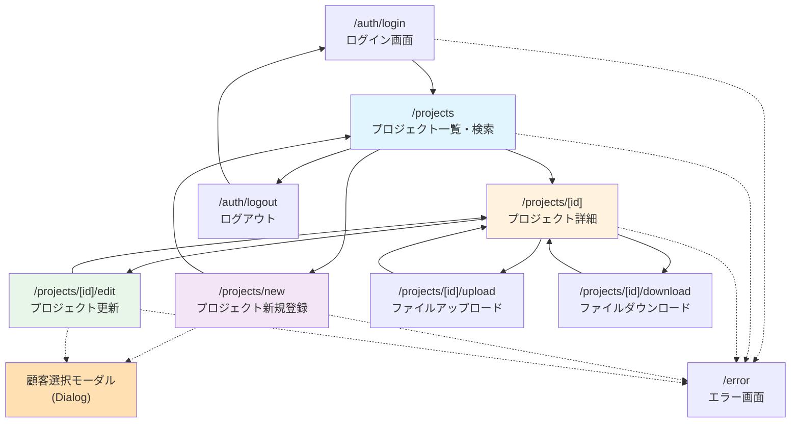

# 画面設計書 (Next.js版)

## 文書情報

| 項目 | 内容 |
|------|------|
| システム名 | プロジェクト管理システム |
| サブシステム | A1_プロジェクト管理システム |
| 文書名 | 画面設計書 (Next.js版) |
| 版数 | 2.0 |
| 作成日 | 2025-11-27 |
| 最終更新日 | 2025-11-27 |
| フレームワーク | Next.js 14+ (App Router) |
| UIライブラリ | React 18+ |

## 目次

1. [画面遷移図](#画面遷移図)
2. [技術スタック](#技術スタック)
3. [設計概要](#設計概要)
4. [共通コンポーネント](#共通コンポーネント)
5. [画面仕様](#画面仕様)
6. [状態管理](#状態管理)
7. [API設計](#api設計)
8. [バリデーション](#バリデーション)

---

## 画面遷移図

### Mermaid フローチャート



### ルート構造

```
app/
├── (auth)/
│   ├── login/
│   │   └── page.tsx          # ログイン画面
│   └── logout/
│       └── page.tsx          # ログアウト画面
├── projects/
│   ├── page.tsx              # プロジェクト一覧・検索 (WA10103)
│   ├── new/
│   │   └── page.tsx          # プロジェクト新規登録 (WA10201)
│   └── [id]/
│       ├── page.tsx          # プロジェクト詳細 (WA10202)
│       ├── edit/
│       │   └── page.tsx      # プロジェクト更新 (WA10203)
│       ├── upload/
│       │   └── page.tsx      # ファイルアップロード (WA10206)
│       └── download/
│           └── page.tsx      # ファイルダウンロード (WA10205)
├── error/
│   └── page.tsx              # エラー画面 (WA10104)
└── layout.tsx                # ルートレイアウト
```

### 画面遷移詳細

| 遷移元画面 | 遷移元ルート | 遷移先画面 | 遷移先ルート | 遷移条件/操作 |
|-----------|-------------|-----------|-------------|--------------|
| - | - | ログイン画面 | `/auth/login` | システム初回アクセス |
| ログイン画面 | `/auth/login` | プロジェクト一覧 | `/projects` | 認証成功後、router.push() |
| ログイン画面 | `/auth/login` | エラー画面 | `/error` | 認証失敗時 |
| プロジェクト一覧 | `/projects` | 新規登録画面 | `/projects/new` | 新規登録ボタン押下 (Link) |
| プロジェクト一覧 | `/projects` | 詳細画面 | `/projects/[id]` | プロジェクト行クリック (Link) |
| プロジェクト一覧 | `/projects` | ログアウト | `/auth/logout` | ログアウトボタン押下 |
| 新規登録画面 | `/projects/new` | プロジェクト一覧 | `/projects` | 登録完了/キャンセル (router.push/back) |
| 詳細画面 | `/projects/[id]` | 更新画面 | `/projects/[id]/edit` | 編集ボタン押下 (Link) |
| 詳細画面 | `/projects/[id]` | アップロード | `/projects/[id]/upload` | アップロードボタン押下 |
| 詳細画面 | `/projects/[id]` | ダウンロード | `/projects/[id]/download` | ダウンロードボタン押下 |
| 更新画面 | `/projects/[id]/edit` | 詳細画面 | `/projects/[id]` | 更新完了/キャンセル |
| アップロード | `/projects/[id]/upload` | 詳細画面 | `/projects/[id]` | アップロード完了 |
| ダウンロード | `/projects/[id]/download` | 詳細画面 | `/projects/[id]` | ダウンロード完了 |
| 全画面 | `*` | エラー画面 | `/error` | システムエラー発生時 |

---

## 技術スタック

### フロントエンド

| カテゴリ | 技術 | バージョン | 用途 |
|---------|------|-----------|------|
| フレームワーク | Next.js | 14.2+ | フルスタックReactフレームワーク |
| UIライブラリ | React | 18.3+ | UIコンポーネント構築 |
| 言語 | TypeScript | 5.3+ | 型安全な開発 |
| スタイリング | Tailwind CSS | 3.4+ | ユーティリティファーストCSS |
| UIコンポーネント | shadcn/ui | latest | 再利用可能なコンポーネント |
| フォーム管理 | React Hook Form | 7.51+ | フォーム状態管理 |
| バリデーション | Zod | 3.22+ | スキーマバリデーション |
| 状態管理 | TanStack Query | 5.28+ | サーバー状態管理 |
| HTTP通信 | fetch API | - | APIリクエスト |

### バックエンド (Next.js API Routes/Server Actions)

| カテゴリ | 技術 | 用途 |
|---------|------|------|
| API Routes | Next.js Route Handlers | RESTful API エンドポイント |
| Server Actions | React Server Actions | フォーム送信、ミューテーション |
| 認証 | NextAuth.js | JWT認証、セッション管理 |
| ORM | Prisma | データベースアクセス |

### 開発ツール

| カテゴリ | 技術 | 用途 |
|---------|------|------|
| パッケージマネージャ | npm/pnpm | 依存関係管理 |
| リンター | ESLint | コード品質チェック |
| フォーマッター | Prettier | コードフォーマット |
| テスト | Vitest + Testing Library | 単体・統合テスト |

---

## 設計概要

### アーキテクチャ構成

```
┌─────────────────────────────────────────────────────┐
│              クライアントサイド (CSR)                │
│                                                     │
│  ┌──────────────────────────────────────────────┐  │
│  │         React Client Components              │  │
│  │  - Interactive UI (forms, modals, dialogs)   │  │
│  │  - State Management (useState, React Query)  │  │
│  │  - Event Handlers (onClick, onChange)        │  │
│  └──────────────────────────────────────────────┘  │
└─────────────────────────────────────────────────────┘
                        │
                        ↓ (fetch/Server Actions)
┌─────────────────────────────────────────────────────┐
│              サーバーサイド (SSR/RSC)                │
│                                                     │
│  ┌──────────────────────────────────────────────┐  │
│  │         React Server Components              │  │
│  │  - Initial Data Fetching                     │  │
│  │  - SEO Optimization                          │  │
│  │  - Server-side Rendering                     │  │
│  └──────────────────────────────────────────────┘  │
│                                                     │
│  ┌──────────────────────────────────────────────┐  │
│  │         API Routes / Server Actions          │  │
│  │  - Business Logic                            │  │
│  │  - Validation (Zod schemas)                  │  │
│  │  - Authentication (NextAuth.js)              │  │
│  │  - Authorization                             │  │
│  └──────────────────────────────────────────────┘  │
│                                                     │
│  ┌──────────────────────────────────────────────┐  │
│  │         Data Access Layer (Prisma)           │  │
│  │  - Database Queries                          │  │
│  │  - Transaction Management                    │  │
│  │  - Data Mapping                              │  │
│  └──────────────────────────────────────────────┘  │
└─────────────────────────────────────────────────────┘
                        │
                        ↓
┌─────────────────────────────────────────────────────┐
│                   データベース層                      │
│                                                     │
│  ┌──────────┐  ┌──────────┐  ┌──────────┐         │
│  │ Project  │  │  Client  │  │   User   │         │
│  │  Table   │  │  Table   │  │  Table   │         │
│  └──────────┘  └──────────┘  └──────────┘         │
└─────────────────────────────────────────────────────┘
```

### レイヤー別責務

#### クライアントコンポーネント層
- **責務**: ユーザーインタラクション、動的UI更新
- **技術**: 'use client' ディレクティブ、useState、useEffect
- **例**: フォーム入力、モーダル、ボタンクリック

#### サーバーコンポーネント層
- **責務**: 初期データ取得、SEO最適化、静的レンダリング
- **技術**: React Server Components (デフォルト)
- **例**: プロジェクト一覧の初期表示、詳細情報取得

#### API層 / Server Actions層
- **責務**: ビジネスロジック、バリデーション、認証・認可
- **技術**: API Routes (`app/api/**/route.ts`), Server Actions
- **例**: プロジェクト登録・更新・削除、認証処理

#### データアクセス層
- **責務**: データベース操作、トランザクション管理
- **技術**: Prisma ORM
- **例**: CRUD操作、リレーション取得

---

## 共通コンポーネント

### 1. ProjectSearchForm

プロジェクト検索フォームコンポーネント（クライアントコンポーネント）

#### 型定義

```typescript
// types/project.ts
export interface ProjectSearchParams {
  projectName?: string;
  clientName?: string;
  status?: ProjectStatus;
  page?: number;
  limit?: number;
}

export type ProjectStatus = 'PLANNING' | 'IN_PROGRESS' | 'COMPLETED' | 'ON_HOLD' | 'CANCELLED';
```

#### コンポーネント実装

```typescript
// components/projects/ProjectSearchForm.tsx
'use client';

import { useForm } from 'react-hook-form';
import { zodResolver } from '@hookform/resolvers/zod';
import { z } from 'zod';
import { Button } from '@/components/ui/button';
import { Input } from '@/components/ui/input';
import { Select, SelectContent, SelectItem, SelectTrigger, SelectValue } from '@/components/ui/select';
import { Form, FormControl, FormField, FormItem, FormLabel } from '@/components/ui/form';

const searchSchema = z.object({
  projectName: z.string().optional(),
  clientName: z.string().optional(),
  status: z.enum(['PLANNING', 'IN_PROGRESS', 'COMPLETED', 'ON_HOLD', 'CANCELLED', '']).optional(),
});

type SearchFormData = z.infer<typeof searchSchema>;

interface ProjectSearchFormProps {
  onSearch: (params: SearchFormData) => void;
  defaultValues?: SearchFormData;
}

export function ProjectSearchForm({ onSearch, defaultValues }: ProjectSearchFormProps) {
  const form = useForm<SearchFormData>({
    resolver: zodResolver(searchSchema),
    defaultValues: defaultValues || {
      projectName: '',
      clientName: '',
      status: '',
    },
  });

  const handleSubmit = (data: SearchFormData) => {
    onSearch(data);
  };

  const handleReset = () => {
    form.reset({
      projectName: '',
      clientName: '',
      status: '',
    });
    onSearch({});
  };

  return (
    <Form {...form}>
      <form onSubmit={form.handleSubmit(handleSubmit)} className="space-y-4">
        <div className="grid grid-cols-1 md:grid-cols-3 gap-4">
          <FormField
            control={form.control}
            name="projectName"
            render={({ field }) => (
              <FormItem>
                <FormLabel>プロジェクト名</FormLabel>
                <FormControl>
                  <Input placeholder="プロジェクト名で検索" {...field} />
                </FormControl>
              </FormItem>
            )}
          />

          <FormField
            control={form.control}
            name="clientName"
            render={({ field }) => (
              <FormItem>
                <FormLabel>顧客名</FormLabel>
                <FormControl>
                  <Input placeholder="顧客名で検索" {...field} />
                </FormControl>
              </FormItem>
            )}
          />

          <FormField
            control={form.control}
            name="status"
            render={({ field }) => (
              <FormItem>
                <FormLabel>ステータス</FormLabel>
                <Select onValueChange={field.onChange} defaultValue={field.value}>
                  <FormControl>
                    <SelectTrigger>
                      <SelectValue placeholder="ステータスを選択" />
                    </SelectTrigger>
                  </FormControl>
                  <SelectContent>
                    <SelectItem value="">すべて</SelectItem>
                    <SelectItem value="PLANNING">計画中</SelectItem>
                    <SelectItem value="IN_PROGRESS">進行中</SelectItem>
                    <SelectItem value="COMPLETED">完了</SelectItem>
                    <SelectItem value="ON_HOLD">保留中</SelectItem>
                    <SelectItem value="CANCELLED">キャンセル</SelectItem>
                  </SelectContent>
                </Select>
              </FormItem>
            )}
          />
        </div>

        <div className="flex gap-2">
          <Button type="submit">検索</Button>
          <Button type="button" variant="outline" onClick={handleReset}>
            リセット
          </Button>
        </div>
      </form>
    </Form>
  );
}
```

---

### 2. ProjectTable

プロジェクト一覧テーブルコンポーネント（クライアントコンポーネント）

#### 型定義

```typescript
// types/project.ts
export interface Project {
  id: string;
  projectName: string;
  projectType: string;
  status: ProjectStatus;
  clientId: string;
  clientName: string;
  startDate: Date;
  endDate?: Date | null;
  createdAt: Date;
  updatedAt: Date;
  createdBy: string;
  updatedBy: string;
}
```

#### コンポーネント実装

```typescript
// components/projects/ProjectTable.tsx
'use client';

import { useRouter } from 'next/navigation';
import { Table, TableBody, TableCell, TableHead, TableHeader, TableRow } from '@/components/ui/table';
import { Badge } from '@/components/ui/badge';
import { formatDate } from '@/lib/utils';
import type { Project } from '@/types/project';

interface ProjectTableProps {
  projects: Project[];
  isLoading?: boolean;
}

const statusColors = {
  PLANNING: 'bg-blue-100 text-blue-800',
  IN_PROGRESS: 'bg-green-100 text-green-800',
  COMPLETED: 'bg-gray-100 text-gray-800',
  ON_HOLD: 'bg-yellow-100 text-yellow-800',
  CANCELLED: 'bg-red-100 text-red-800',
} as const;

const statusLabels = {
  PLANNING: '計画中',
  IN_PROGRESS: '進行中',
  COMPLETED: '完了',
  ON_HOLD: '保留中',
  CANCELLED: 'キャンセル',
} as const;

export function ProjectTable({ projects, isLoading }: ProjectTableProps) {
  const router = useRouter();

  const handleRowClick = (projectId: string) => {
    router.push(`/projects/${projectId}`);
  };

  if (isLoading) {
    return (
      <div className="flex justify-center items-center h-64">
        <div className="animate-spin rounded-full h-12 w-12 border-b-2 border-gray-900" />
      </div>
    );
  }

  if (projects.length === 0) {
    return (
      <div className="text-center py-12 text-gray-500">
        プロジェクトが見つかりませんでした
      </div>
    );
  }

  return (
    <div className="rounded-md border">
      <Table>
        <TableHeader>
          <TableRow>
            <TableHead>プロジェクトID</TableHead>
            <TableHead>プロジェクト名</TableHead>
            <TableHead>顧客名</TableHead>
            <TableHead>ステータス</TableHead>
            <TableHead>開始日</TableHead>
            <TableHead>終了日</TableHead>
            <TableHead>更新日時</TableHead>
          </TableRow>
        </TableHeader>
        <TableBody>
          {projects.map((project) => (
            <TableRow
              key={project.id}
              className="cursor-pointer hover:bg-gray-50"
              onClick={() => handleRowClick(project.id)}
            >
              <TableCell className="font-mono text-sm">{project.id}</TableCell>
              <TableCell className="font-medium">{project.projectName}</TableCell>
              <TableCell>{project.clientName}</TableCell>
              <TableCell>
                <Badge className={statusColors[project.status]}>
                  {statusLabels[project.status]}
                </Badge>
              </TableCell>
              <TableCell>{formatDate(project.startDate)}</TableCell>
              <TableCell>{project.endDate ? formatDate(project.endDate) : '-'}</TableCell>
              <TableCell>{formatDate(project.updatedAt)}</TableCell>
            </TableRow>
          ))}
        </TableBody>
      </Table>
    </div>
  );
}
```

---

### 3. ProjectForm

プロジェクト登録・更新フォームコンポーネント（クライアントコンポーネント）

#### バリデーションスキーマ

```typescript
// lib/validations/project.ts
import { z } from 'zod';

export const projectFormSchema = z.object({
  projectName: z.string()
    .min(1, 'プロジェクト名は必須です')
    .max(100, 'プロジェクト名は100文字以内で入力してください'),

  projectType: z.string()
    .min(1, 'プロジェクト種類は必須です'),

  description: z.string()
    .max(500, '説明は500文字以内で入力してください')
    .optional(),

  clientId: z.string()
    .min(1, '顧客は必須です'),

  startDate: z.date({
    required_error: '開始日は必須です',
  }),

  endDate: z.date()
    .optional()
    .nullable(),

  status: z.enum(['PLANNING', 'IN_PROGRESS', 'COMPLETED', 'ON_HOLD', 'CANCELLED'], {
    required_error: 'ステータスは必須です',
  }),
}).refine((data) => {
  if (data.endDate && data.startDate) {
    return data.endDate >= data.startDate;
  }
  return true;
}, {
  message: '終了日は開始日以降の日付を指定してください',
  path: ['endDate'],
});

export type ProjectFormData = z.infer<typeof projectFormSchema>;
```

#### コンポーネント実装

```typescript
// components/projects/ProjectForm.tsx
'use client';

import { useState } from 'react';
import { useForm } from 'react-hook-form';
import { zodResolver } from '@hookform/resolvers/zod';
import { useRouter } from 'next/navigation';
import { CalendarIcon } from 'lucide-react';
import { format } from 'date-fns';
import { ja } from 'date-fns/locale';

import { Button } from '@/components/ui/button';
import { Input } from '@/components/ui/input';
import { Textarea } from '@/components/ui/textarea';
import { Select, SelectContent, SelectItem, SelectTrigger, SelectValue } from '@/components/ui/select';
import { Form, FormControl, FormField, FormItem, FormLabel, FormMessage } from '@/components/ui/form';
import { Calendar } from '@/components/ui/calendar';
import { Popover, PopoverContent, PopoverTrigger } from '@/components/ui/popover';
import { CustomerSelectDialog } from '@/components/customers/CustomerSelectDialog';
import { projectFormSchema, type ProjectFormData } from '@/lib/validations/project';
import { cn } from '@/lib/utils';

interface ProjectFormProps {
  initialData?: Partial<ProjectFormData> & { clientName?: string };
  mode: 'create' | 'edit';
  onSubmit: (data: ProjectFormData) => Promise<void>;
}

export function ProjectForm({ initialData, mode, onSubmit }: ProjectFormProps) {
  const router = useRouter();
  const [isCustomerDialogOpen, setIsCustomerDialogOpen] = useState(false);
  const [selectedClientName, setSelectedClientName] = useState(initialData?.clientName || '');
  const [isSubmitting, setIsSubmitting] = useState(false);

  const form = useForm<ProjectFormData>({
    resolver: zodResolver(projectFormSchema),
    defaultValues: {
      projectName: initialData?.projectName || '',
      projectType: initialData?.projectType || '',
      description: initialData?.description || '',
      clientId: initialData?.clientId || '',
      startDate: initialData?.startDate || new Date(),
      endDate: initialData?.endDate || null,
      status: initialData?.status || 'PLANNING',
    },
  });

  const handleCustomerSelect = (customerId: string, customerName: string) => {
    form.setValue('clientId', customerId);
    setSelectedClientName(customerName);
    setIsCustomerDialogOpen(false);
  };

  const handleSubmit = async (data: ProjectFormData) => {
    try {
      setIsSubmitting(true);
      await onSubmit(data);
    } catch (error) {
      console.error('Form submission error:', error);
    } finally {
      setIsSubmitting(false);
    }
  };

  const handleCancel = () => {
    if (mode === 'edit' && initialData?.id) {
      router.push(`/projects/${initialData.id}`);
    } else {
      router.push('/projects');
    }
  };

  return (
    <>
      <Form {...form}>
        <form onSubmit={form.handleSubmit(handleSubmit)} className="space-y-6">
          <FormField
            control={form.control}
            name="projectName"
            render={({ field }) => (
              <FormItem>
                <FormLabel>プロジェクト名 <span className="text-red-500">*</span></FormLabel>
                <FormControl>
                  <Input placeholder="プロジェクト名を入力" {...field} />
                </FormControl>
                <FormMessage />
              </FormItem>
            )}
          />

          <FormField
            control={form.control}
            name="projectType"
            render={({ field }) => (
              <FormItem>
                <FormLabel>プロジェクト種類 <span className="text-red-500">*</span></FormLabel>
                <Select onValueChange={field.onChange} defaultValue={field.value}>
                  <FormControl>
                    <SelectTrigger>
                      <SelectValue placeholder="プロジェクト種類を選択" />
                    </SelectTrigger>
                  </FormControl>
                  <SelectContent>
                    <SelectItem value="WEB_DEVELOPMENT">Web開発</SelectItem>
                    <SelectItem value="MOBILE_APP">モバイルアプリ</SelectItem>
                    <SelectItem value="SYSTEM_INTEGRATION">システム統合</SelectItem>
                    <SelectItem value="CONSULTING">コンサルティング</SelectItem>
                    <SelectItem value="MAINTENANCE">保守運用</SelectItem>
                  </SelectContent>
                </Select>
                <FormMessage />
              </FormItem>
            )}
          />

          <FormField
            control={form.control}
            name="description"
            render={({ field }) => (
              <FormItem>
                <FormLabel>プロジェクト説明</FormLabel>
                <FormControl>
                  <Textarea
                    placeholder="プロジェクトの説明を入力"
                    className="resize-none"
                    rows={4}
                    {...field}
                  />
                </FormControl>
                <FormMessage />
              </FormItem>
            )}
          />

          <FormField
            control={form.control}
            name="clientId"
            render={({ field }) => (
              <FormItem>
                <FormLabel>顧客 <span className="text-red-500">*</span></FormLabel>
                <div className="flex gap-2">
                  <FormControl>
                    <Input
                      placeholder="顧客名"
                      value={selectedClientName}
                      readOnly
                      className="flex-1"
                    />
                  </FormControl>
                  <Button
                    type="button"
                    variant="outline"
                    onClick={() => setIsCustomerDialogOpen(true)}
                  >
                    顧客選択
                  </Button>
                </div>
                <FormMessage />
              </FormItem>
            )}
          />

          <div className="grid grid-cols-1 md:grid-cols-2 gap-4">
            <FormField
              control={form.control}
              name="startDate"
              render={({ field }) => (
                <FormItem className="flex flex-col">
                  <FormLabel>開始日 <span className="text-red-500">*</span></FormLabel>
                  <Popover>
                    <PopoverTrigger asChild>
                      <FormControl>
                        <Button
                          variant="outline"
                          className={cn(
                            'w-full pl-3 text-left font-normal',
                            !field.value && 'text-muted-foreground'
                          )}
                        >
                          {field.value ? (
                            format(field.value, 'yyyy年MM月dd日', { locale: ja })
                          ) : (
                            <span>日付を選択</span>
                          )}
                          <CalendarIcon className="ml-auto h-4 w-4 opacity-50" />
                        </Button>
                      </FormControl>
                    </PopoverTrigger>
                    <PopoverContent className="w-auto p-0" align="start">
                      <Calendar
                        mode="single"
                        selected={field.value}
                        onSelect={field.onChange}
                        locale={ja}
                        initialFocus
                      />
                    </PopoverContent>
                  </Popover>
                  <FormMessage />
                </FormItem>
              )}
            />

            <FormField
              control={form.control}
              name="endDate"
              render={({ field }) => (
                <FormItem className="flex flex-col">
                  <FormLabel>終了日</FormLabel>
                  <Popover>
                    <PopoverTrigger asChild>
                      <FormControl>
                        <Button
                          variant="outline"
                          className={cn(
                            'w-full pl-3 text-left font-normal',
                            !field.value && 'text-muted-foreground'
                          )}
                        >
                          {field.value ? (
                            format(field.value, 'yyyy年MM月dd日', { locale: ja })
                          ) : (
                            <span>日付を選択</span>
                          )}
                          <CalendarIcon className="ml-auto h-4 w-4 opacity-50" />
                        </Button>
                      </FormControl>
                    </PopoverTrigger>
                    <PopoverContent className="w-auto p-0" align="start">
                      <Calendar
                        mode="single"
                        selected={field.value || undefined}
                        onSelect={field.onChange}
                        locale={ja}
                        initialFocus
                      />
                    </PopoverContent>
                  </Popover>
                  <FormMessage />
                </FormItem>
              )}
            />
          </div>

          <FormField
            control={form.control}
            name="status"
            render={({ field }) => (
              <FormItem>
                <FormLabel>ステータス <span className="text-red-500">*</span></FormLabel>
                <Select onValueChange={field.onChange} defaultValue={field.value}>
                  <FormControl>
                    <SelectTrigger>
                      <SelectValue placeholder="ステータスを選択" />
                    </SelectTrigger>
                  </FormControl>
                  <SelectContent>
                    <SelectItem value="PLANNING">計画中</SelectItem>
                    <SelectItem value="IN_PROGRESS">進行中</SelectItem>
                    <SelectItem value="COMPLETED">完了</SelectItem>
                    <SelectItem value="ON_HOLD">保留中</SelectItem>
                    <SelectItem value="CANCELLED">キャンセル</SelectItem>
                  </SelectContent>
                </Select>
                <FormMessage />
              </FormItem>
            )}
          />

          <div className="flex gap-2 justify-end">
            <Button
              type="button"
              variant="outline"
              onClick={handleCancel}
              disabled={isSubmitting}
            >
              キャンセル
            </Button>
            <Button type="submit" disabled={isSubmitting}>
              {isSubmitting ? '処理中...' : mode === 'create' ? '登録' : '更新'}
            </Button>
          </div>
        </form>
      </Form>

      <CustomerSelectDialog
        open={isCustomerDialogOpen}
        onClose={() => setIsCustomerDialogOpen(false)}
        onSelect={handleCustomerSelect}
      />
    </>
  );
}
```

---

### 4. Pagination

ページネーションコンポーネント（クライアントコンポーネント）

```typescript
// components/ui/pagination-controls.tsx
'use client';

import { useRouter, useSearchParams } from 'next/navigation';
import { Button } from '@/components/ui/button';
import { ChevronLeft, ChevronRight, ChevronsLeft, ChevronsRight } from 'lucide-react';

interface PaginationControlsProps {
  totalCount: number;
  pageSize: number;
  currentPage: number;
}

export function PaginationControls({ totalCount, pageSize, currentPage }: PaginationControlsProps) {
  const router = useRouter();
  const searchParams = useSearchParams();
  const totalPages = Math.ceil(totalCount / pageSize);

  const createPageURL = (page: number) => {
    const params = new URLSearchParams(searchParams);
    params.set('page', page.toString());
    return `?${params.toString()}`;
  };

  const handlePageChange = (page: number) => {
    router.push(createPageURL(page));
  };

  if (totalPages <= 1) return null;

  return (
    <div className="flex items-center justify-between px-2 py-4">
      <div className="text-sm text-gray-700">
        {totalCount}件中 {(currentPage - 1) * pageSize + 1}〜
        {Math.min(currentPage * pageSize, totalCount)}件を表示
      </div>

      <div className="flex items-center gap-2">
        <Button
          variant="outline"
          size="sm"
          onClick={() => handlePageChange(1)}
          disabled={currentPage === 1}
        >
          <ChevronsLeft className="h-4 w-4" />
        </Button>

        <Button
          variant="outline"
          size="sm"
          onClick={() => handlePageChange(currentPage - 1)}
          disabled={currentPage === 1}
        >
          <ChevronLeft className="h-4 w-4" />
        </Button>

        <div className="text-sm">
          {currentPage} / {totalPages}
        </div>

        <Button
          variant="outline"
          size="sm"
          onClick={() => handlePageChange(currentPage + 1)}
          disabled={currentPage === totalPages}
        >
          <ChevronRight className="h-4 w-4" />
        </Button>

        <Button
          variant="outline"
          size="sm"
          onClick={() => handlePageChange(totalPages)}
          disabled={currentPage === totalPages}
        >
          <ChevronsRight className="h-4 w-4" />
        </Button>
      </div>
    </div>
  );
}
```

---

### 5. CustomerSelectDialog

顧客選択モーダルコンポーネント（クライアントコンポーネント）

```typescript
// components/customers/CustomerSelectDialog.tsx
'use client';

import { useState } from 'react';
import { useQuery } from '@tanstack/react-query';
import { Dialog, DialogContent, DialogHeader, DialogTitle } from '@/components/ui/dialog';
import { Input } from '@/components/ui/input';
import { Button } from '@/components/ui/button';
import { Table, TableBody, TableCell, TableHead, TableHeader, TableRow } from '@/components/ui/table';

interface Customer {
  id: string;
  customerCode: string;
  customerName: string;
  email: string;
}

interface CustomerSelectDialogProps {
  open: boolean;
  onClose: () => void;
  onSelect: (customerId: string, customerName: string) => void;
}

export function CustomerSelectDialog({ open, onClose, onSelect }: CustomerSelectDialogProps) {
  const [searchName, setSearchName] = useState('');
  const [searchCode, setSearchCode] = useState('');

  const { data: customers, isLoading } = useQuery({
    queryKey: ['customers', searchName, searchCode],
    queryFn: async () => {
      const params = new URLSearchParams();
      if (searchName) params.append('name', searchName);
      if (searchCode) params.append('code', searchCode);

      const response = await fetch(`/api/customers?${params}`);
      if (!response.ok) throw new Error('顧客の取得に失敗しました');
      return response.json() as Promise<Customer[]>;
    },
    enabled: open,
  });

  const handleSelect = (customer: Customer) => {
    onSelect(customer.id, customer.customerName);
  };

  return (
    <Dialog open={open} onOpenChange={onClose}>
      <DialogContent className="max-w-4xl max-h-[80vh]">
        <DialogHeader>
          <DialogTitle>顧客選択</DialogTitle>
        </DialogHeader>

        <div className="space-y-4">
          <div className="grid grid-cols-2 gap-4">
            <Input
              placeholder="顧客名で検索"
              value={searchName}
              onChange={(e) => setSearchName(e.target.value)}
            />
            <Input
              placeholder="顧客コードで検索"
              value={searchCode}
              onChange={(e) => setSearchCode(e.target.value)}
            />
          </div>

          <div className="border rounded-md max-h-96 overflow-y-auto">
            {isLoading ? (
              <div className="flex justify-center py-8">
                <div className="animate-spin rounded-full h-8 w-8 border-b-2 border-gray-900" />
              </div>
            ) : (
              <Table>
                <TableHeader>
                  <TableRow>
                    <TableHead>顧客コード</TableHead>
                    <TableHead>顧客名</TableHead>
                    <TableHead>メールアドレス</TableHead>
                    <TableHead className="w-24">操作</TableHead>
                  </TableRow>
                </TableHeader>
                <TableBody>
                  {customers?.map((customer) => (
                    <TableRow key={customer.id}>
                      <TableCell className="font-mono">{customer.customerCode}</TableCell>
                      <TableCell>{customer.customerName}</TableCell>
                      <TableCell>{customer.email}</TableCell>
                      <TableCell>
                        <Button
                          size="sm"
                          onClick={() => handleSelect(customer)}
                        >
                          選択
                        </Button>
                      </TableCell>
                    </TableRow>
                  ))}
                </TableBody>
              </Table>
            )}
          </div>

          <div className="flex justify-end">
            <Button variant="outline" onClick={onClose}>
              キャンセル
            </Button>
          </div>
        </div>
      </DialogContent>
    </Dialog>
  );
}
```

---

## 画面仕様

### WA10103 - プロジェクト一覧・検索画面

#### 画面ID
`/projects` (page.tsx)

#### 画面概要
プロジェクト一覧の表示と検索機能を提供するメイン画面

#### コンポーネント種別
- **Server Component**: 初期データ取得
- **Client Component**: 検索フォーム、テーブル、ページネーション

#### 実装例

```typescript
// app/projects/page.tsx (Server Component)
import { Suspense } from 'react';
import Link from 'next/link';
import { Button } from '@/components/ui/button';
import { PlusCircle } from 'lucide-react';
import { ProjectSearchClient } from './ProjectSearchClient';

interface SearchParams {
  projectName?: string;
  clientName?: string;
  status?: string;
  page?: string;
}

export default async function ProjectsPage({
  searchParams,
}: {
  searchParams: SearchParams;
}) {
  const page = Number(searchParams.page) || 1;
  const limit = 20;

  // Server-side data fetching
  const { projects, totalCount } = await fetchProjects({
    projectName: searchParams.projectName,
    clientName: searchParams.clientName,
    status: searchParams.status,
    page,
    limit,
  });

  return (
    <div className="container mx-auto py-8 space-y-6">
      <div className="flex justify-between items-center">
        <h1 className="text-3xl font-bold">プロジェクト一覧</h1>
        <Link href="/projects/new">
          <Button>
            <PlusCircle className="mr-2 h-4 w-4" />
            新規登録
          </Button>
        </Link>
      </div>

      <Suspense fallback={<div>読み込み中...</div>}>
        <ProjectSearchClient
          initialProjects={projects}
          initialTotalCount={totalCount}
          initialSearchParams={searchParams}
        />
      </Suspense>
    </div>
  );
}

// Server-side data fetching function
async function fetchProjects(params: {
  projectName?: string;
  clientName?: string;
  status?: string;
  page: number;
  limit: number;
}) {
  // Prisma query example
  const where = {
    ...(params.projectName && {
      projectName: { contains: params.projectName },
    }),
    ...(params.clientName && {
      client: { clientName: { contains: params.clientName } },
    }),
    ...(params.status && { status: params.status }),
  };

  const [projects, totalCount] = await Promise.all([
    prisma.project.findMany({
      where,
      include: { client: true },
      skip: (params.page - 1) * params.limit,
      take: params.limit,
      orderBy: { updatedAt: 'desc' },
    }),
    prisma.project.count({ where }),
  ]);

  return { projects, totalCount };
}
```

```typescript
// app/projects/ProjectSearchClient.tsx (Client Component)
'use client';

import { useState } from 'react';
import { useRouter } from 'next/navigation';
import { useQuery } from '@tanstack/react-query';
import { ProjectSearchForm } from '@/components/projects/ProjectSearchForm';
import { ProjectTable } from '@/components/projects/ProjectTable';
import { PaginationControls } from '@/components/ui/pagination-controls';
import type { Project } from '@/types/project';

interface ProjectSearchClientProps {
  initialProjects: Project[];
  initialTotalCount: number;
  initialSearchParams: any;
}

export function ProjectSearchClient({
  initialProjects,
  initialTotalCount,
  initialSearchParams,
}: ProjectSearchClientProps) {
  const router = useRouter();
  const [currentPage, setCurrentPage] = useState(
    Number(initialSearchParams.page) || 1
  );

  const { data, isLoading } = useQuery({
    queryKey: ['projects', initialSearchParams, currentPage],
    queryFn: async () => {
      const params = new URLSearchParams({
        ...initialSearchParams,
        page: currentPage.toString(),
      });
      const response = await fetch(`/api/projects?${params}`);
      if (!response.ok) throw new Error('データの取得に失敗しました');
      return response.json();
    },
    initialData: {
      projects: initialProjects,
      totalCount: initialTotalCount,
    },
  });

  const handleSearch = (searchParams: any) => {
    const params = new URLSearchParams();
    Object.entries(searchParams).forEach(([key, value]) => {
      if (value) params.append(key, String(value));
    });
    router.push(`/projects?${params.toString()}`);
    setCurrentPage(1);
  };

  return (
    <div className="space-y-6">
      <ProjectSearchForm
        onSearch={handleSearch}
        defaultValues={initialSearchParams}
      />

      <ProjectTable
        projects={data?.projects || []}
        isLoading={isLoading}
      />

      <PaginationControls
        totalCount={data?.totalCount || 0}
        pageSize={20}
        currentPage={currentPage}
      />
    </div>
  );
}
```

#### 画面項目定義

| 項目名 | 型 | 必須 | 説明 |
|--------|-----|------|------|
| projectName | string | × | プロジェクト名検索条件 |
| clientName | string | × | 顧客名検索条件 |
| status | ProjectStatus | × | ステータス検索条件 |
| page | number | × | ページ番号 (デフォルト: 1) |
| limit | number | × | 1ページあたりの表示件数 (デフォルト: 20) |

#### 状態管理

```typescript
// React Query状態
{
  queryKey: ['projects', searchParams, currentPage],
  data: {
    projects: Project[];
    totalCount: number;
  },
  isLoading: boolean;
  isError: boolean;
  error: Error | null;
}
```

#### イベントハンドラ

| イベント | ハンドラ | 処理内容 |
|---------|---------|---------|
| 検索ボタンクリック | handleSearch | URL更新 → Server Component再レンダリング |
| テーブル行クリック | handleRowClick | `/projects/[id]` へ遷移 |
| 新規登録ボタンクリック | Link | `/projects/new` へ遷移 |
| ページネーション | handlePageChange | URLパラメータ更新 → 再取得 |

---

### WA10202 - プロジェクト詳細画面

#### 画面ID
`/projects/[id]` (page.tsx)

#### 画面概要
選択したプロジェクトの詳細情報を表示する画面

#### コンポーネント種別
- **Server Component**: プロジェクト詳細取得
- **Client Component**: 削除ボタン、アクション

#### 実装例

```typescript
// app/projects/[id]/page.tsx (Server Component)
import { notFound } from 'next/navigation';
import Link from 'next/link';
import { Button } from '@/components/ui/button';
import { Edit, Trash2, Upload, Download, ArrowLeft } from 'lucide-react';
import { ProjectDetailClient } from './ProjectDetailClient';
import { formatDate } from '@/lib/utils';

interface ProjectDetailPageProps {
  params: { id: string };
}

export default async function ProjectDetailPage({ params }: ProjectDetailPageProps) {
  const project = await fetchProjectDetail(params.id);

  if (!project) {
    notFound();
  }

  return (
    <div className="container mx-auto py-8 space-y-6">
      <div className="flex items-center gap-4">
        <Link href="/projects">
          <Button variant="outline" size="sm">
            <ArrowLeft className="mr-2 h-4 w-4" />
            一覧に戻る
          </Button>
        </Link>
        <h1 className="text-3xl font-bold">プロジェクト詳細</h1>
      </div>

      <div className="bg-white rounded-lg shadow p-6 space-y-4">
        <div className="grid grid-cols-2 gap-4">
          <div>
            <div className="text-sm text-gray-500">プロジェクトID</div>
            <div className="font-mono">{project.id}</div>
          </div>
          <div>
            <div className="text-sm text-gray-500">ステータス</div>
            <div className="font-semibold">{getStatusLabel(project.status)}</div>
          </div>
        </div>

        <div>
          <div className="text-sm text-gray-500">プロジェクト名</div>
          <div className="text-xl font-bold">{project.projectName}</div>
        </div>

        <div>
          <div className="text-sm text-gray-500">プロジェクト種類</div>
          <div>{getProjectTypeLabel(project.projectType)}</div>
        </div>

        <div>
          <div className="text-sm text-gray-500">プロジェクト説明</div>
          <div className="whitespace-pre-wrap">{project.description || '-'}</div>
        </div>

        <div className="grid grid-cols-2 gap-4">
          <div>
            <div className="text-sm text-gray-500">顧客名</div>
            <div>{project.client.clientName}</div>
          </div>
          <div>
            <div className="text-sm text-gray-500">顧客コード</div>
            <div className="font-mono">{project.client.customerCode}</div>
          </div>
        </div>

        <div className="grid grid-cols-2 gap-4">
          <div>
            <div className="text-sm text-gray-500">開始日</div>
            <div>{formatDate(project.startDate)}</div>
          </div>
          <div>
            <div className="text-sm text-gray-500">終了日</div>
            <div>{project.endDate ? formatDate(project.endDate) : '-'}</div>
          </div>
        </div>

        <div className="grid grid-cols-2 gap-4 pt-4 border-t">
          <div>
            <div className="text-sm text-gray-500">登録日時</div>
            <div className="text-sm">{formatDate(project.createdAt)}</div>
            <div className="text-xs text-gray-400">登録者: {project.createdBy}</div>
          </div>
          <div>
            <div className="text-sm text-gray-500">更新日時</div>
            <div className="text-sm">{formatDate(project.updatedAt)}</div>
            <div className="text-xs text-gray-400">更新者: {project.updatedBy}</div>
          </div>
        </div>
      </div>

      <div className="flex gap-2 justify-end">
        <Link href={`/projects/${project.id}/upload`}>
          <Button variant="outline">
            <Upload className="mr-2 h-4 w-4" />
            アップロード
          </Button>
        </Link>
        <Link href={`/projects/${project.id}/download`}>
          <Button variant="outline">
            <Download className="mr-2 h-4 w-4" />
            ダウンロード
          </Button>
        </Link>
        <Link href={`/projects/${project.id}/edit`}>
          <Button>
            <Edit className="mr-2 h-4 w-4" />
            編集
          </Button>
        </Link>
        <ProjectDetailClient projectId={project.id} />
      </div>
    </div>
  );
}

async function fetchProjectDetail(id: string) {
  const project = await prisma.project.findUnique({
    where: { id },
    include: {
      client: true,
    },
  });

  return project;
}

function getStatusLabel(status: string): string {
  const labels: Record<string, string> = {
    PLANNING: '計画中',
    IN_PROGRESS: '進行中',
    COMPLETED: '完了',
    ON_HOLD: '保留中',
    CANCELLED: 'キャンセル',
  };
  return labels[status] || status;
}

function getProjectTypeLabel(type: string): string {
  const labels: Record<string, string> = {
    WEB_DEVELOPMENT: 'Web開発',
    MOBILE_APP: 'モバイルアプリ',
    SYSTEM_INTEGRATION: 'システム統合',
    CONSULTING: 'コンサルティング',
    MAINTENANCE: '保守運用',
  };
  return labels[type] || type;
}
```

```typescript
// app/projects/[id]/ProjectDetailClient.tsx (Client Component)
'use client';

import { useState } from 'react';
import { useRouter } from 'next/navigation';
import { Trash2 } from 'lucide-react';
import { Button } from '@/components/ui/button';
import {
  AlertDialog,
  AlertDialogAction,
  AlertDialogCancel,
  AlertDialogContent,
  AlertDialogDescription,
  AlertDialogFooter,
  AlertDialogHeader,
  AlertDialogTitle,
  AlertDialogTrigger,
} from '@/components/ui/alert-dialog';
import { useToast } from '@/components/ui/use-toast';

interface ProjectDetailClientProps {
  projectId: string;
}

export function ProjectDetailClient({ projectId }: ProjectDetailClientProps) {
  const router = useRouter();
  const { toast } = useToast();
  const [isDeleting, setIsDeleting] = useState(false);

  const handleDelete = async () => {
    try {
      setIsDeleting(true);

      const response = await fetch(`/api/projects/${projectId}`, {
        method: 'DELETE',
      });

      if (!response.ok) {
        throw new Error('削除に失敗しました');
      }

      toast({
        title: '成功',
        description: 'プロジェクトを削除しました',
      });

      router.push('/projects');
      router.refresh();
    } catch (error) {
      toast({
        title: 'エラー',
        description: error instanceof Error ? error.message : '削除に失敗しました',
        variant: 'destructive',
      });
    } finally {
      setIsDeleting(false);
    }
  };

  return (
    <AlertDialog>
      <AlertDialogTrigger asChild>
        <Button variant="destructive">
          <Trash2 className="mr-2 h-4 w-4" />
          削除
        </Button>
      </AlertDialogTrigger>
      <AlertDialogContent>
        <AlertDialogHeader>
          <AlertDialogTitle>プロジェクトの削除</AlertDialogTitle>
          <AlertDialogDescription>
            このプロジェクトを削除してもよろしいですか？
            この操作は取り消すことができません。
          </AlertDialogDescription>
        </AlertDialogHeader>
        <AlertDialogFooter>
          <AlertDialogCancel>キャンセル</AlertDialogCancel>
          <AlertDialogAction
            onClick={handleDelete}
            disabled={isDeleting}
            className="bg-red-600 hover:bg-red-700"
          >
            {isDeleting ? '削除中...' : '削除する'}
          </AlertDialogAction>
        </AlertDialogFooter>
      </AlertDialogContent>
    </AlertDialog>
  );
}
```

#### 画面項目定義

| 項目名 | 型 | 表示/入力 | 説明 |
|--------|-----|----------|------|
| id | string | 表示のみ | プロジェクトID |
| projectName | string | 表示のみ | プロジェクト名 |
| projectType | string | 表示のみ | プロジェクト種類 |
| description | string | 表示のみ | プロジェクト説明 |
| clientId | string | - | 顧客ID (内部) |
| clientName | string | 表示のみ | 顧客名 |
| customerCode | string | 表示のみ | 顧客コード |
| status | ProjectStatus | 表示のみ | ステータス |
| startDate | Date | 表示のみ | 開始日 |
| endDate | Date | 表示のみ | 終了日 |
| createdAt | Date | 表示のみ | 登録日時 |
| createdBy | string | 表示のみ | 登録者 |
| updatedAt | Date | 表示のみ | 更新日時 |
| updatedBy | string | 表示のみ | 更新者 |

#### イベントハンドラ

| イベント | ハンドラ | 処理内容 |
|---------|---------|---------|
| 編集ボタンクリック | Link | `/projects/[id]/edit` へ遷移 |
| 削除ボタンクリック | handleDelete | 削除確認 → DELETE API実行 → 一覧へ遷移 |
| アップロードボタンクリック | Link | `/projects/[id]/upload` へ遷移 |
| ダウンロードボタンクリック | Link | `/projects/[id]/download` へ遷移 |
| 戻るボタンクリック | Link | `/projects` へ遷移 |

---

### WA10201 - プロジェクト新規登録画面

#### 画面ID
`/projects/new` (page.tsx)

#### 画面概要
新規プロジェクトを登録する画面

#### コンポーネント種別
- **Server Component**: ページ構造
- **Client Component**: フォーム、バリデーション

#### 実装例

```typescript
// app/projects/new/page.tsx (Server Component)
import { ProjectNewClient } from './ProjectNewClient';

export default function ProjectNewPage() {
  return (
    <div className="container mx-auto py-8 space-y-6">
      <h1 className="text-3xl font-bold">プロジェクト新規登録</h1>

      <div className="bg-white rounded-lg shadow p-6">
        <ProjectNewClient />
      </div>
    </div>
  );
}
```

```typescript
// app/projects/new/ProjectNewClient.tsx (Client Component)
'use client';

import { useRouter } from 'next/navigation';
import { ProjectForm } from '@/components/projects/ProjectForm';
import { useToast } from '@/components/ui/use-toast';
import type { ProjectFormData } from '@/lib/validations/project';

export function ProjectNewClient() {
  const router = useRouter();
  const { toast } = useToast();

  const handleSubmit = async (data: ProjectFormData) => {
    try {
      const response = await fetch('/api/projects', {
        method: 'POST',
        headers: { 'Content-Type': 'application/json' },
        body: JSON.stringify(data),
      });

      if (!response.ok) {
        const error = await response.json();
        throw new Error(error.message || '登録に失敗しました');
      }

      const project = await response.json();

      toast({
        title: '成功',
        description: 'プロジェクトを登録しました',
      });

      router.push('/projects');
      router.refresh();
    } catch (error) {
      toast({
        title: 'エラー',
        description: error instanceof Error ? error.message : '登録に失敗しました',
        variant: 'destructive',
      });
      throw error;
    }
  };

  return (
    <ProjectForm
      mode="create"
      onSubmit={handleSubmit}
    />
  );
}
```

#### バリデーション

```typescript
// Zodスキーマ (再掲)
export const projectFormSchema = z.object({
  projectName: z.string()
    .min(1, 'プロジェクト名は必須です')
    .max(100, 'プロジェクト名は100文字以内で入力してください'),

  projectType: z.string()
    .min(1, 'プロジェクト種類は必須です'),

  description: z.string()
    .max(500, '説明は500文字以内で入力してください')
    .optional(),

  clientId: z.string()
    .min(1, '顧客は必須です'),

  startDate: z.date({
    required_error: '開始日は必須です',
  }),

  endDate: z.date()
    .optional()
    .nullable(),

  status: z.enum(['PLANNING', 'IN_PROGRESS', 'COMPLETED', 'ON_HOLD', 'CANCELLED'], {
    required_error: 'ステータスは必須です',
  }),
}).refine((data) => {
  if (data.endDate && data.startDate) {
    return data.endDate >= data.startDate;
  }
  return true;
}, {
  message: '終了日は開始日以降の日付を指定してください',
  path: ['endDate'],
});
```

#### 画面項目チェック定義

| 項目名 | 必須 | 最小 | 最大 | 形式 | エラーメッセージ |
|--------|------|------|------|------|------------------|
| projectName | ○ | 1 | 100 | 文字列 | プロジェクト名は必須です / 100文字以内で入力してください |
| projectType | ○ | - | - | 選択 | プロジェクト種類は必須です |
| description | - | - | 500 | 文字列 | 説明は500文字以内で入力してください |
| clientId | ○ | - | - | UUID | 顧客は必須です |
| startDate | ○ | - | - | Date | 開始日は必須です |
| endDate | - | - | - | Date | 終了日は開始日以降の日付を指定してください |
| status | ○ | - | - | 列挙型 | ステータスは必須です |

#### API呼び出し

```typescript
// POST /api/projects
const response = await fetch('/api/projects', {
  method: 'POST',
  headers: { 'Content-Type': 'application/json' },
  body: JSON.stringify({
    projectName: 'サンプルプロジェクト',
    projectType: 'WEB_DEVELOPMENT',
    description: 'プロジェクトの説明',
    clientId: 'customer-uuid',
    startDate: new Date('2025-01-01'),
    endDate: new Date('2025-12-31'),
    status: 'PLANNING',
  }),
});
```

---

### WA10203 - プロジェクト更新画面

#### 画面ID
`/projects/[id]/edit` (page.tsx)

#### 画面概要
既存プロジェクトの情報を更新する画面

#### コンポーネント種別
- **Server Component**: 既存データ取得
- **Client Component**: フォーム、バリデーション

#### 実装例

```typescript
// app/projects/[id]/edit/page.tsx (Server Component)
import { notFound } from 'next/navigation';
import { ProjectEditClient } from './ProjectEditClient';

interface ProjectEditPageProps {
  params: { id: string };
}

export default async function ProjectEditPage({ params }: ProjectEditPageProps) {
  const project = await fetchProjectForEdit(params.id);

  if (!project) {
    notFound();
  }

  return (
    <div className="container mx-auto py-8 space-y-6">
      <h1 className="text-3xl font-bold">プロジェクト更新</h1>

      <div className="bg-white rounded-lg shadow p-6">
        <ProjectEditClient project={project} />
      </div>
    </div>
  );
}

async function fetchProjectForEdit(id: string) {
  const project = await prisma.project.findUnique({
    where: { id },
    include: {
      client: true,
    },
  });

  return project;
}
```

```typescript
// app/projects/[id]/edit/ProjectEditClient.tsx (Client Component)
'use client';

import { useRouter } from 'next/navigation';
import { ProjectForm } from '@/components/projects/ProjectForm';
import { useToast } from '@/components/ui/use-toast';
import type { ProjectFormData } from '@/lib/validations/project';

interface ProjectEditClientProps {
  project: any; // Project型を適切に定義
}

export function ProjectEditClient({ project }: ProjectEditClientProps) {
  const router = useRouter();
  const { toast } = useToast();

  const handleSubmit = async (data: ProjectFormData) => {
    try {
      const response = await fetch(`/api/projects/${project.id}`, {
        method: 'PUT',
        headers: { 'Content-Type': 'application/json' },
        body: JSON.stringify(data),
      });

      if (!response.ok) {
        const error = await response.json();
        throw new Error(error.message || '更新に失敗しました');
      }

      toast({
        title: '成功',
        description: 'プロジェクトを更新しました',
      });

      router.push(`/projects/${project.id}`);
      router.refresh();
    } catch (error) {
      toast({
        title: 'エラー',
        description: error instanceof Error ? error.message : '更新に失敗しました',
        variant: 'destructive',
      });
      throw error;
    }
  };

  return (
    <ProjectForm
      mode="edit"
      initialData={{
        id: project.id,
        projectName: project.projectName,
        projectType: project.projectType,
        description: project.description,
        clientId: project.clientId,
        clientName: project.client.clientName,
        startDate: new Date(project.startDate),
        endDate: project.endDate ? new Date(project.endDate) : null,
        status: project.status,
      }}
      onSubmit={handleSubmit}
    />
  );
}
```

#### API呼び出し

```typescript
// PUT /api/projects/[id]
const response = await fetch(`/api/projects/${projectId}`, {
  method: 'PUT',
  headers: { 'Content-Type': 'application/json' },
  body: JSON.stringify({
    projectName: '更新されたプロジェクト名',
    projectType: 'WEB_DEVELOPMENT',
    description: '更新された説明',
    clientId: 'customer-uuid',
    startDate: new Date('2025-01-01'),
    endDate: new Date('2025-12-31'),
    status: 'IN_PROGRESS',
  }),
});
```

---

## 状態管理

### React Query 状態管理

#### QueryClient設定

```typescript
// app/providers.tsx
'use client';

import { QueryClient, QueryClientProvider } from '@tanstack/react-query';
import { ReactQueryDevtools } from '@tanstack/react-query-devtools';
import { useState } from 'react';

export function Providers({ children }: { children: React.ReactNode }) {
  const [queryClient] = useState(
    () =>
      new QueryClient({
        defaultOptions: {
          queries: {
            staleTime: 60 * 1000, // 1分
            refetchOnWindowFocus: false,
            retry: 1,
          },
        },
      })
  );

  return (
    <QueryClientProvider client={queryClient}>
      {children}
      <ReactQueryDevtools initialIsOpen={false} />
    </QueryClientProvider>
  );
}
```

#### カスタムフック例

```typescript
// hooks/useProjects.ts
import { useQuery, useMutation, useQueryClient } from '@tanstack/react-query';
import type { Project, ProjectSearchParams, ProjectFormData } from '@/types/project';

// プロジェクト一覧取得
export function useProjects(params: ProjectSearchParams) {
  return useQuery({
    queryKey: ['projects', params],
    queryFn: async () => {
      const searchParams = new URLSearchParams();
      Object.entries(params).forEach(([key, value]) => {
        if (value !== undefined && value !== null && value !== '') {
          searchParams.append(key, String(value));
        }
      });

      const response = await fetch(`/api/projects?${searchParams}`);
      if (!response.ok) throw new Error('プロジェクトの取得に失敗しました');
      return response.json() as Promise<{
        projects: Project[];
        totalCount: number;
      }>;
    },
  });
}

// プロジェクト詳細取得
export function useProject(id: string) {
  return useQuery({
    queryKey: ['project', id],
    queryFn: async () => {
      const response = await fetch(`/api/projects/${id}`);
      if (!response.ok) throw new Error('プロジェクトの取得に失敗しました');
      return response.json() as Promise<Project>;
    },
    enabled: !!id,
  });
}

// プロジェクト作成
export function useCreateProject() {
  const queryClient = useQueryClient();

  return useMutation({
    mutationFn: async (data: ProjectFormData) => {
      const response = await fetch('/api/projects', {
        method: 'POST',
        headers: { 'Content-Type': 'application/json' },
        body: JSON.stringify(data),
      });

      if (!response.ok) {
        const error = await response.json();
        throw new Error(error.message || '登録に失敗しました');
      }

      return response.json();
    },
    onSuccess: () => {
      queryClient.invalidateQueries({ queryKey: ['projects'] });
    },
  });
}

// プロジェクト更新
export function useUpdateProject(id: string) {
  const queryClient = useQueryClient();

  return useMutation({
    mutationFn: async (data: ProjectFormData) => {
      const response = await fetch(`/api/projects/${id}`, {
        method: 'PUT',
        headers: { 'Content-Type': 'application/json' },
        body: JSON.stringify(data),
      });

      if (!response.ok) {
        const error = await response.json();
        throw new Error(error.message || '更新に失敗しました');
      }

      return response.json();
    },
    onSuccess: () => {
      queryClient.invalidateQueries({ queryKey: ['projects'] });
      queryClient.invalidateQueries({ queryKey: ['project', id] });
    },
  });
}

// プロジェクト削除
export function useDeleteProject() {
  const queryClient = useQueryClient();

  return useMutation({
    mutationFn: async (id: string) => {
      const response = await fetch(`/api/projects/${id}`, {
        method: 'DELETE',
      });

      if (!response.ok) {
        const error = await response.json();
        throw new Error(error.message || '削除に失敗しました');
      }

      return response.json();
    },
    onSuccess: () => {
      queryClient.invalidateQueries({ queryKey: ['projects'] });
    },
  });
}
```

### 画面状態定義

#### プロジェクト一覧画面

```typescript
interface ProjectListState {
  // 検索パラメータ
  searchParams: {
    projectName: string;
    clientName: string;
    status: ProjectStatus | '';
    page: number;
    limit: number;
  };

  // React Query状態
  projects: {
    data?: {
      projects: Project[];
      totalCount: number;
    };
    isLoading: boolean;
    isError: boolean;
    error: Error | null;
  };

  // UI状態
  selectedProjectIds: string[];
  sortColumn: string;
  sortDirection: 'asc' | 'desc';
}
```

#### プロジェクト詳細画面

```typescript
interface ProjectDetailState {
  // データ
  project?: Project;

  // React Query状態
  isLoading: boolean;
  isError: boolean;
  error: Error | null;

  // UI状態
  isDeleteDialogOpen: boolean;
  isDeleting: boolean;
}
```

#### プロジェクトフォーム画面

```typescript
interface ProjectFormState {
  // フォームデータ (React Hook Form)
  formData: ProjectFormData;

  // フォーム状態
  isDirty: boolean;
  isValid: boolean;
  errors: FieldErrors<ProjectFormData>;

  // 送信状態
  isSubmitting: boolean;

  // UI状態
  isCustomerDialogOpen: boolean;
  selectedCustomer?: {
    id: string;
    name: string;
  };
}
```

---

## API設計

### API Routes

#### 1. プロジェクト一覧取得

```typescript
// app/api/projects/route.ts
import { NextRequest, NextResponse } from 'next/server';
import { getServerSession } from 'next-auth';
import { authOptions } from '@/lib/auth';
import { prisma } from '@/lib/prisma';

export async function GET(request: NextRequest) {
  try {
    // 認証チェック
    const session = await getServerSession(authOptions);
    if (!session) {
      return NextResponse.json(
        { error: '認証が必要です' },
        { status: 401 }
      );
    }

    // クエリパラメータ取得
    const searchParams = request.nextUrl.searchParams;
    const projectName = searchParams.get('projectName') || undefined;
    const clientName = searchParams.get('clientName') || undefined;
    const status = searchParams.get('status') || undefined;
    const page = parseInt(searchParams.get('page') || '1');
    const limit = parseInt(searchParams.get('limit') || '20');

    // WHERE条件構築
    const where = {
      ...(projectName && {
        projectName: { contains: projectName, mode: 'insensitive' },
      }),
      ...(clientName && {
        client: {
          clientName: { contains: clientName, mode: 'insensitive' },
        },
      }),
      ...(status && { status }),
    };

    // データ取得
    const [projects, totalCount] = await Promise.all([
      prisma.project.findMany({
        where,
        include: {
          client: {
            select: {
              id: true,
              customerCode: true,
              clientName: true,
            },
          },
        },
        skip: (page - 1) * limit,
        take: limit,
        orderBy: { updatedAt: 'desc' },
      }),
      prisma.project.count({ where }),
    ]);

    return NextResponse.json({
      projects,
      totalCount,
      page,
      limit,
      totalPages: Math.ceil(totalCount / limit),
    });
  } catch (error) {
    console.error('Project list fetch error:', error);
    return NextResponse.json(
      { error: 'プロジェクト一覧の取得に失敗しました' },
      { status: 500 }
    );
  }
}
```

#### 2. プロジェクト作成

```typescript
// app/api/projects/route.ts (POST)
export async function POST(request: NextRequest) {
  try {
    const session = await getServerSession(authOptions);
    if (!session) {
      return NextResponse.json(
        { error: '認証が必要です' },
        { status: 401 }
      );
    }

    const body = await request.json();

    // Zodバリデーション
    const validatedData = projectFormSchema.parse(body);

    // プロジェクト作成
    const project = await prisma.project.create({
      data: {
        ...validatedData,
        createdBy: session.user.id,
        updatedBy: session.user.id,
      },
      include: {
        client: true,
      },
    });

    return NextResponse.json(project, { status: 201 });
  } catch (error) {
    console.error('Project creation error:', error);

    if (error instanceof z.ZodError) {
      return NextResponse.json(
        { error: 'バリデーションエラー', details: error.errors },
        { status: 400 }
      );
    }

    return NextResponse.json(
      { error: 'プロジェクトの作成に失敗しました' },
      { status: 500 }
    );
  }
}
```

#### 3. プロジェクト詳細取得

```typescript
// app/api/projects/[id]/route.ts
import { NextRequest, NextResponse } from 'next/server';

export async function GET(
  request: NextRequest,
  { params }: { params: { id: string } }
) {
  try {
    const session = await getServerSession(authOptions);
    if (!session) {
      return NextResponse.json(
        { error: '認証が必要です' },
        { status: 401 }
      );
    }

    const project = await prisma.project.findUnique({
      where: { id: params.id },
      include: {
        client: true,
      },
    });

    if (!project) {
      return NextResponse.json(
        { error: 'プロジェクトが見つかりません' },
        { status: 404 }
      );
    }

    return NextResponse.json(project);
  } catch (error) {
    console.error('Project fetch error:', error);
    return NextResponse.json(
      { error: 'プロジェクトの取得に失敗しました' },
      { status: 500 }
    );
  }
}
```

#### 4. プロジェクト更新

```typescript
// app/api/projects/[id]/route.ts (PUT)
export async function PUT(
  request: NextRequest,
  { params }: { params: { id: string } }
) {
  try {
    const session = await getServerSession(authOptions);
    if (!session) {
      return NextResponse.json(
        { error: '認証が必要です' },
        { status: 401 }
      );
    }

    const body = await request.json();
    const validatedData = projectFormSchema.parse(body);

    // 既存チェック
    const existingProject = await prisma.project.findUnique({
      where: { id: params.id },
    });

    if (!existingProject) {
      return NextResponse.json(
        { error: 'プロジェクトが見つかりません' },
        { status: 404 }
      );
    }

    // 更新
    const updatedProject = await prisma.project.update({
      where: { id: params.id },
      data: {
        ...validatedData,
        updatedBy: session.user.id,
      },
      include: {
        client: true,
      },
    });

    return NextResponse.json(updatedProject);
  } catch (error) {
    console.error('Project update error:', error);

    if (error instanceof z.ZodError) {
      return NextResponse.json(
        { error: 'バリデーションエラー', details: error.errors },
        { status: 400 }
      );
    }

    return NextResponse.json(
      { error: 'プロジェクトの更新に失敗しました' },
      { status: 500 }
    );
  }
}
```

#### 5. プロジェクト削除

```typescript
// app/api/projects/[id]/route.ts (DELETE)
export async function DELETE(
  request: NextRequest,
  { params }: { params: { id: string } }
) {
  try {
    const session = await getServerSession(authOptions);
    if (!session) {
      return NextResponse.json(
        { error: '認証が必要です' },
        { status: 401 }
      );
    }

    // 既存チェック
    const existingProject = await prisma.project.findUnique({
      where: { id: params.id },
    });

    if (!existingProject) {
      return NextResponse.json(
        { error: 'プロジェクトが見つかりません' },
        { status: 404 }
      );
    }

    // 削除 (論理削除の場合)
    await prisma.project.update({
      where: { id: params.id },
      data: {
        deletedAt: new Date(),
        deletedBy: session.user.id,
      },
    });

    // 物理削除の場合
    // await prisma.project.delete({
    //   where: { id: params.id },
    // });

    return NextResponse.json({ message: '削除しました' });
  } catch (error) {
    console.error('Project delete error:', error);
    return NextResponse.json(
      { error: 'プロジェクトの削除に失敗しました' },
      { status: 500 }
    );
  }
}
```

### Server Actions (代替実装)

```typescript
// app/actions/projects.ts
'use server';

import { revalidatePath } from 'next/cache';
import { redirect } from 'next/navigation';
import { getServerSession } from 'next-auth';
import { authOptions } from '@/lib/auth';
import { prisma } from '@/lib/prisma';
import { projectFormSchema, type ProjectFormData } from '@/lib/validations/project';

export async function createProject(data: ProjectFormData) {
  const session = await getServerSession(authOptions);
  if (!session) {
    throw new Error('認証が必要です');
  }

  const validatedData = projectFormSchema.parse(data);

  const project = await prisma.project.create({
    data: {
      ...validatedData,
      createdBy: session.user.id,
      updatedBy: session.user.id,
    },
  });

  revalidatePath('/projects');
  redirect('/projects');
}

export async function updateProject(id: string, data: ProjectFormData) {
  const session = await getServerSession(authOptions);
  if (!session) {
    throw new Error('認証が必要です');
  }

  const validatedData = projectFormSchema.parse(data);

  const project = await prisma.project.update({
    where: { id },
    data: {
      ...validatedData,
      updatedBy: session.user.id,
    },
  });

  revalidatePath('/projects');
  revalidatePath(`/projects/${id}`);
  redirect(`/projects/${id}`);
}

export async function deleteProject(id: string) {
  const session = await getServerSession(authOptions);
  if (!session) {
    throw new Error('認証が必要です');
  }

  await prisma.project.update({
    where: { id },
    data: {
      deletedAt: new Date(),
      deletedBy: session.user.id,
    },
  });

  revalidatePath('/projects');
  redirect('/projects');
}
```

---

## バリデーション

### Zodスキーマ定義

```typescript
// lib/validations/project.ts (完全版)
import { z } from 'zod';

// プロジェクトステータス
export const projectStatusSchema = z.enum([
  'PLANNING',
  'IN_PROGRESS',
  'COMPLETED',
  'ON_HOLD',
  'CANCELLED',
]);

// プロジェクト種類
export const projectTypeSchema = z.enum([
  'WEB_DEVELOPMENT',
  'MOBILE_APP',
  'SYSTEM_INTEGRATION',
  'CONSULTING',
  'MAINTENANCE',
]);

// プロジェクトフォームスキーマ
export const projectFormSchema = z.object({
  projectName: z.string()
    .min(1, 'プロジェクト名は必須です')
    .max(100, 'プロジェクト名は100文字以内で入力してください')
    .regex(/^[a-zA-Z0-9ぁ-んァ-ヶー一-龠々\s\-_]+$/, '使用できない文字が含まれています'),

  projectType: projectTypeSchema,

  description: z.string()
    .max(500, '説明は500文字以内で入力してください')
    .optional()
    .nullable(),

  clientId: z.string()
    .uuid('無効な顧客IDです')
    .min(1, '顧客は必須です'),

  startDate: z.coerce.date({
    required_error: '開始日は必須です',
    invalid_type_error: '無効な日付形式です',
  }),

  endDate: z.coerce.date({
    invalid_type_error: '無効な日付形式です',
  }).optional().nullable(),

  status: projectStatusSchema,
}).refine(
  (data) => {
    if (data.endDate && data.startDate) {
      return data.endDate >= data.startDate;
    }
    return true;
  },
  {
    message: '終了日は開始日以降の日付を指定してください',
    path: ['endDate'],
  }
).refine(
  (data) => {
    if (data.status === 'COMPLETED' && !data.endDate) {
      return false;
    }
    return true;
  },
  {
    message: 'ステータスが完了の場合、終了日は必須です',
    path: ['endDate'],
  }
);

// 検索パラメータスキーマ
export const projectSearchSchema = z.object({
  projectName: z.string().optional(),
  clientName: z.string().optional(),
  status: projectStatusSchema.or(z.literal('')).optional(),
  page: z.coerce.number().min(1).default(1),
  limit: z.coerce.number().min(1).max(100).default(20),
});

// 型エクスポート
export type ProjectFormData = z.infer<typeof projectFormSchema>;
export type ProjectSearchParams = z.infer<typeof projectSearchSchema>;
export type ProjectStatus = z.infer<typeof projectStatusSchema>;
export type ProjectType = z.infer<typeof projectTypeSchema>;
```

### エラーメッセージ一覧

| フィールド | エラータイプ | メッセージ |
|-----------|------------|-----------|
| projectName | required | プロジェクト名は必須です |
| projectName | max | プロジェクト名は100文字以内で入力してください |
| projectName | regex | 使用できない文字が含まれています |
| projectType | required | プロジェクト種類は必須です |
| description | max | 説明は500文字以内で入力してください |
| clientId | required | 顧客は必須です |
| clientId | uuid | 無効な顧客IDです |
| startDate | required | 開始日は必須です |
| startDate | invalid_type | 無効な日付形式です |
| endDate | invalid_type | 無効な日付形式です |
| endDate | refine | 終了日は開始日以降の日付を指定してください |
| endDate | refine | ステータスが完了の場合、終了日は必須です |
| status | required | ステータスは必須です |

---

## ユーティリティ関数

```typescript
// lib/utils.ts
import { type ClassValue, clsx } from 'clsx';
import { twMerge } from 'tailwind-merge';
import { format } from 'date-fns';
import { ja } from 'date-fns/locale';

export function cn(...inputs: ClassValue[]) {
  return twMerge(clsx(inputs));
}

export function formatDate(
  date: Date | string | null | undefined,
  formatStr: string = 'yyyy年MM月dd日'
): string {
  if (!date) return '-';
  const dateObj = typeof date === 'string' ? new Date(date) : date;
  return format(dateObj, formatStr, { locale: ja });
}

export function formatDateTime(
  date: Date | string | null | undefined
): string {
  return formatDate(date, 'yyyy年MM月dd日 HH:mm');
}

export function getStatusLabel(status: ProjectStatus): string {
  const labels: Record<ProjectStatus, string> = {
    PLANNING: '計画中',
    IN_PROGRESS: '進行中',
    COMPLETED: '完了',
    ON_HOLD: '保留中',
    CANCELLED: 'キャンセル',
  };
  return labels[status];
}

export function getProjectTypeLabel(type: ProjectType): string {
  const labels: Record<ProjectType, string> = {
    WEB_DEVELOPMENT: 'Web開発',
    MOBILE_APP: 'モバイルアプリ',
    SYSTEM_INTEGRATION: 'システム統合',
    CONSULTING: 'コンサルティング',
    MAINTENANCE: '保守運用',
  };
  return labels[type];
}
```

---

## まとめ

### Next.js版の主な変更点

1. **ルーティング**: Spring MVC → Next.js App Router
2. **レンダリング**: Thymeleaf → React Server/Client Components
3. **状態管理**: セッション/モデル → React Query + useState
4. **バリデーション**: Hibernate Validator → Zod
5. **フォーム管理**: Spring Form → React Hook Form
6. **API通信**: Controller → API Routes / Server Actions
7. **認証**: Spring Security → NextAuth.js

### 技術的メリット

- **型安全性**: TypeScript + Zodによる完全な型安全性
- **パフォーマンス**: Server Componentsによる高速な初期レンダリング
- **開発体験**: Hot Reload、型推論、自動補完
- **SEO**: サーバーサイドレンダリングによるSEO最適化
- **ユーザー体験**: クライアントサイドルーティングによるスムーズな画面遷移

### ディレクトリ構造

```
design-docs-viewer/
├── app/
│   ├── (auth)/
│   │   ├── login/page.tsx
│   │   └── logout/page.tsx
│   ├── projects/
│   │   ├── page.tsx
│   │   ├── new/page.tsx
│   │   ├── [id]/
│   │   │   ├── page.tsx
│   │   │   ├── edit/page.tsx
│   │   │   ├── upload/page.tsx
│   │   │   └── download/page.tsx
│   │   └── ProjectSearchClient.tsx
│   ├── api/
│   │   ├── projects/
│   │   │   ├── route.ts
│   │   │   └── [id]/route.ts
│   │   └── customers/route.ts
│   ├── layout.tsx
│   └── providers.tsx
├── components/
│   ├── projects/
│   │   ├── ProjectSearchForm.tsx
│   │   ├── ProjectTable.tsx
│   │   └── ProjectForm.tsx
│   ├── customers/
│   │   └── CustomerSelectDialog.tsx
│   └── ui/
│       └── pagination-controls.tsx
├── lib/
│   ├── validations/
│   │   └── project.ts
│   ├── prisma.ts
│   ├── auth.ts
│   └── utils.ts
├── types/
│   └── project.ts
└── hooks/
    └── useProjects.ts
```

以上がNext.js版の画面設計書となります。
