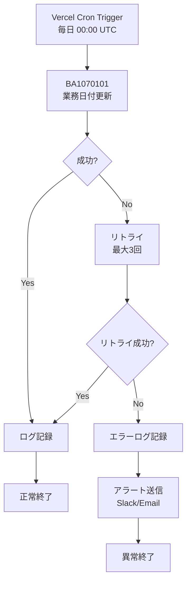
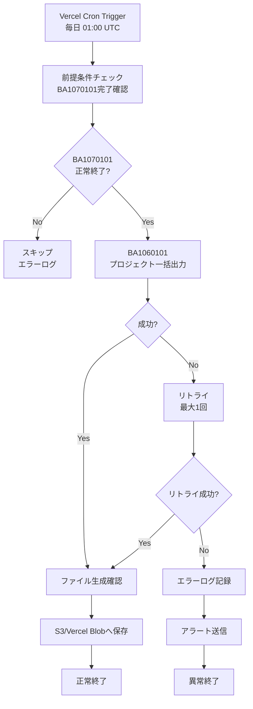
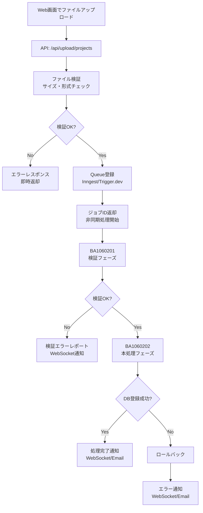
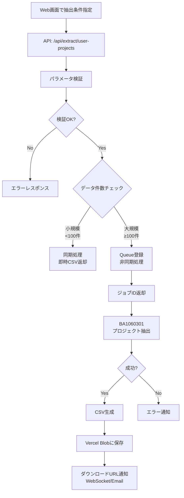
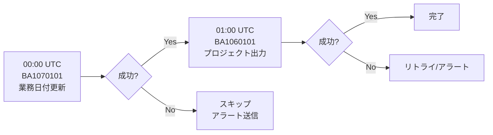
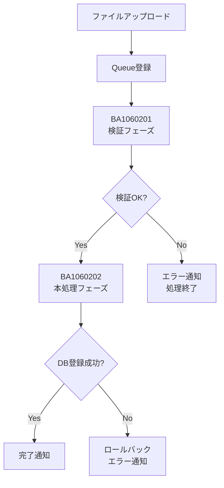
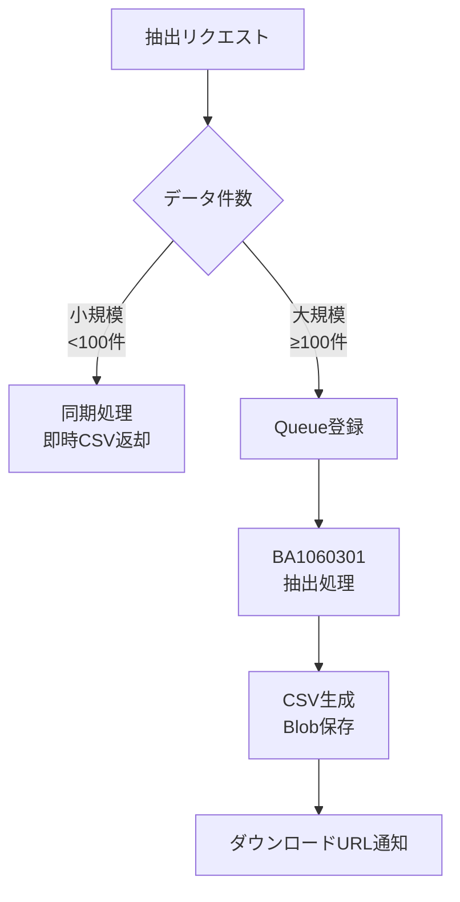

# ジョブフロー設計書

## 文書管理情報
| 項目 | 内容 |
|------|------|
| 文書ID | A1-DESIGN-007 |
| システム名 | A1_プロジェクト管理システム |
| 文書名 | ジョブフロー設計書 |
| バージョン | 2.0 |
| 最終更新日 | 2025-11-27 |
| プラットフォーム | Next.js 14+ (App Router) |

---

## 目次
1. [ジョブネット一覧](#1-ジョブネット一覧)
2. [日次バッチジョブフロー](#2-日次バッチジョブフロー)
3. [オンデマンドジョブフロー](#3-オンデマンドジョブフロー)
4. [ジョブ実行管理](#4-ジョブ実行管理)
5. [依存関係図](#5-依存関係図)
6. [エラーハンドリング](#6-エラーハンドリング)
7. [ログ・監視](#7-ログ監視)
8. [リカバリ手順](#8-リカバリ手順)

---

## 1. ジョブネット一覧

### 1.1 ジョブネット概要

| ジョブネットID | ジョブネット名 | 実行タイプ | 実行タイミング | 実装方式 |
|--------------|-------------|----------|-------------|---------|
| JN-BA1070000 | 業務日付管理ジョブネット | 日次 | 毎日 00:00 | Vercel Cron |
| JN-BA1060000 | プロジェクト出力ジョブネット | 日次 | 毎日 01:00 | Vercel Cron |
| JN-BA1060200 | プロジェクト取込ジョブネット | オンデマンド | API トリガー | Queue (Inngest) |
| JN-BA1060300 | ユーザプロジェクト抽出ジョブネット | オンデマンド | API トリガー | Queue (Inngest) |

### 1.2 ジョブ一覧

| ジョブID | ジョブ名 | 処理タイプ | 所属ジョブネット | API Route | 優先度 |
|---------|---------|----------|---------------|-----------|--------|
| BA1070101 | 業務日付更新 | Cron Job | JN-BA1070000 | `/api/cron/update-business-date` | 高 |
| BA1060101 | 期間内プロジェクト一括出力 | Cron Job | JN-BA1060000 | `/api/cron/export-projects` | 中 |
| BA1060201 | プロジェクト一括取込(検証) | Queue Job | JN-BA1060200 | `/api/jobs/import-projects` | 中 |
| BA1060202 | プロジェクト一括取込(本処理) | Queue Job | JN-BA1060200 | `/api/jobs/import-projects` | 中 |
| BA1060301 | ユーザプロジェクト抽出 | Queue Job | JN-BA1060300 | `/api/jobs/extract-user-projects` | 低 |

---

## 2. 日次バッチジョブフロー

### 2.1 JN-BA1070000: 業務日付管理ジョブネット

#### 2.1.1 ジョブフロー図



#### 2.1.2 ジョブ詳細

**BA1070101: 業務日付更新**

| 項目 | 内容 |
|------|------|
| 処理概要 | 業務日付を1日進める更新処理 |
| 実行タイミング | 毎日 00:00 UTC (JST 09:00) |
| API Route | `/api/cron/update-business-date` |
| 実行条件 | Vercel Cron による自動実行 |
| 前提条件 | BUSINESS_DATEテーブルにレコードが存在すること |
| 入力 | BUSINESS_DATEテーブル |
| 出力 | BUSINESS_DATEテーブル(更新) |
| 想定処理時間 | 1秒未満 |
| タイムアウト | 10秒 (Vercel Function制限) |
| リトライ回数 | 3回 |
| リトライ間隔 | 指数バックオフ (1秒, 2秒, 4秒) |

**実装例:**

```typescript
// app/api/cron/update-business-date/route.ts
import { NextResponse } from 'next/server';
import { headers } from 'next/headers';
import { prisma } from '@/lib/prisma';
import { sendAlert } from '@/lib/alert';

export const dynamic = 'force-dynamic';
export const maxDuration = 10; // seconds

export async function GET(request: Request) {
  try {
    // Vercel Cron認証チェック
    const headersList = headers();
    const authHeader = headersList.get('authorization');

    if (authHeader !== `Bearer ${process.env.CRON_SECRET}`) {
      return NextResponse.json(
        { error: 'Unauthorized' },
        { status: 401 }
      );
    }

    // 業務日付を1日進める
    const result = await prisma.$executeRaw`
      UPDATE "BUSINESS_DATE"
      SET
        business_date = business_date + INTERVAL '1 day',
        updated_by = 'SYSTEM',
        updated_at = CURRENT_TIMESTAMP
      WHERE id = 1
    `;

    if (result === 0) {
      throw new Error('BUSINESS_DATE record not found');
    }

    // 更新後の日付を取得
    const businessDate = await prisma.bUSINESS_DATE.findFirst();

    console.log('[BA1070101] Business date updated:', businessDate?.business_date);

    return NextResponse.json({
      success: true,
      businessDate: businessDate?.business_date,
      timestamp: new Date().toISOString(),
    });

  } catch (error) {
    console.error('[BA1070101] Error:', error);

    // アラート送信
    await sendAlert({
      jobId: 'BA1070101',
      jobName: '業務日付更新',
      error: error instanceof Error ? error.message : 'Unknown error',
      timestamp: new Date().toISOString(),
    });

    return NextResponse.json(
      { error: 'Job failed', details: error instanceof Error ? error.message : 'Unknown' },
      { status: 500 }
    );
  }
}
```

**Vercel Cron設定:**

```json
{
  "crons": [
    {
      "path": "/api/cron/update-business-date",
      "schedule": "0 0 * * *"
    }
  ]
}
```

---

### 2.2 JN-BA1060000: プロジェクト出力ジョブネット

#### 2.2.1 ジョブフロー図



#### 2.2.2 ジョブ詳細

**BA1060101: 期間内プロジェクト一括出力**

| 項目 | 内容 |
|------|------|
| 処理概要 | 業務日付時点で期間内のプロジェクトをCSV出力 |
| 実行タイミング | 毎日 01:00 UTC (JST 10:00) |
| API Route | `/api/cron/export-projects` |
| 実行条件 | BA1070101が正常終了していること |
| 前提条件 | - 業務日付が更新済み<br>- Vercel Blob または S3 が利用可能 |
| 入力 | - BUSINESS_DATEテーブル<br>- PROJECTテーブル<br>- COST_ITEMテーブル<br>- RESOURCE_ASSIGNMENTテーブル |
| 出力 | Vercel Blob: `projects_YYYYMMDD.csv` |
| 想定処理時間 | 5-10分(1万件の場合) |
| タイムアウト | 300秒 (Vercel Pro: 5分) |
| リトライ回数 | 1回 |
| リトライ間隔 | 5分 |

**実装例:**

```typescript
// app/api/cron/export-projects/route.ts
import { NextResponse } from 'next/server';
import { headers } from 'next/headers';
import { prisma } from '@/lib/prisma';
import { put } from '@vercel/blob';
import { sendAlert } from '@/lib/alert';
import { stringify } from 'csv-stringify/sync';

export const dynamic = 'force-dynamic';
export const maxDuration = 300; // 5 minutes (Vercel Pro)

export async function GET(request: Request) {
  try {
    // Vercel Cron認証チェック
    const headersList = headers();
    const authHeader = headersList.get('authorization');

    if (authHeader !== `Bearer ${process.env.CRON_SECRET}`) {
      return NextResponse.json({ error: 'Unauthorized' }, { status: 401 });
    }

    // 業務日付取得
    const businessDate = await prisma.bUSINESS_DATE.findFirst();
    if (!businessDate) {
      throw new Error('Business date not found');
    }

    const currentDate = businessDate.business_date;

    // 期間内プロジェクトを抽出
    const projects = await prisma.pROJECT.findMany({
      where: {
        start_date: { lte: currentDate },
        end_date: { gte: currentDate },
      },
      include: {
        COST_ITEM: true,
        RESOURCE_ASSIGNMENT: {
          include: {
            USER: true,
          },
        },
      },
    });

    // CSV形式に変換
    const csvData = projects.map(project => ({
      プロジェクトコード: project.project_code,
      プロジェクト名: project.project_name,
      開始日: project.start_date.toISOString().split('T')[0],
      終了日: project.end_date.toISOString().split('T')[0],
      ステータス: project.status,
      総予算: project.COST_ITEM.reduce((sum, item) => sum + Number(item.amount), 0),
      進捗率: project.progress_rate,
      担当者数: project.RESOURCE_ASSIGNMENT.length,
    }));

    const csv = stringify(csvData, {
      header: true,
      columns: ['プロジェクトコード', 'プロジェクト名', '開始日', '終了日', 'ステータス', '総予算', '進捗率', '担当者数'],
    });

    // Vercel Blobに保存
    const filename = `projects_${currentDate.toISOString().split('T')[0].replace(/-/g, '')}.csv`;
    const blob = await put(filename, csv, {
      access: 'private',
      contentType: 'text/csv; charset=utf-8',
    });

    console.log('[BA1060101] Export completed:', {
      count: projects.length,
      filename,
      url: blob.url,
    });

    return NextResponse.json({
      success: true,
      count: projects.length,
      filename,
      url: blob.url,
      timestamp: new Date().toISOString(),
    });

  } catch (error) {
    console.error('[BA1060101] Error:', error);

    await sendAlert({
      jobId: 'BA1060101',
      jobName: '期間内プロジェクト一括出力',
      error: error instanceof Error ? error.message : 'Unknown error',
      timestamp: new Date().toISOString(),
    });

    return NextResponse.json(
      { error: 'Job failed', details: error instanceof Error ? error.message : 'Unknown' },
      { status: 500 }
    );
  }
}
```

**Vercel Cron設定:**

```json
{
  "crons": [
    {
      "path": "/api/cron/update-business-date",
      "schedule": "0 0 * * *"
    },
    {
      "path": "/api/cron/export-projects",
      "schedule": "0 1 * * *"
    }
  ]
}
```

---

## 3. オンデマンドジョブフロー

### 3.1 JN-BA1060200: プロジェクト取込ジョブネット

#### 3.1.1 ジョブフロー図



#### 3.1.2 ジョブ詳細

**BA1060201: プロジェクト一括取込(検証)**

| 項目 | 内容 |
|------|------|
| 処理概要 | アップロードされたCSVファイルの検証処理 |
| 実行タイミング | ファイルアップロード時(非同期) |
| API Route | `/api/jobs/import-projects` (POST) |
| Queue | Inngest または Trigger.dev |
| 実行条件 | ユーザがCSVファイルをアップロード |
| 前提条件 | - ファイルがVercel Blobに保存済み<br>- ファイルサイズが10MB以下 |
| 入力 | Vercel Blob上のCSVファイル |
| 出力 | - 検証結果JSON<br>- 検証エラーレポート |
| 想定処理時間 | 1-3分(1000件の場合) |
| タイムアウト | 10分 |
| リトライ回数 | なし(検証エラーはユーザ対応) |

**実装例(Inngest使用):**

```typescript
// app/api/inngest/route.ts
import { serve } from 'inngest/next';
import { inngest } from '@/lib/inngest/client';
import { importProjectsJob } from '@/lib/inngest/jobs/import-projects';

export const { GET, POST, PUT } = serve({
  client: inngest,
  functions: [importProjectsJob],
});
```

```typescript
// lib/inngest/jobs/import-projects.ts
import { inngest } from '@/lib/inngest/client';
import { prisma } from '@/lib/prisma';
import { parse } from 'csv-parse/sync';
import { head } from '@vercel/blob';
import { sendWebSocketNotification } from '@/lib/websocket';

export const importProjectsJob = inngest.createFunction(
  { id: 'import-projects', name: 'プロジェクト一括取込' },
  { event: 'project/import' },
  async ({ event, step }) => {
    const { userId, fileUrl, fileName } = event.data;

    // Step 1: ファイル取得
    const fileBlob = await step.run('fetch-file', async () => {
      const response = await fetch(fileUrl);
      if (!response.ok) throw new Error('File not found');
      return response.text();
    });

    // Step 2: CSV解析
    const records = await step.run('parse-csv', async () => {
      return parse(fileBlob, {
        columns: true,
        skip_empty_lines: true,
        encoding: 'utf-8',
      });
    });

    // Step 3: 検証フェーズ (BA1060201)
    const validationResult = await step.run('validate', async () => {
      const errors: any[] = [];

      for (let i = 0; i < records.length; i++) {
        const record = records[i];
        const rowNum = i + 2; // ヘッダー行を考慮

        // 必須項目チェック
        if (!record.プロジェクトコード) {
          errors.push({ row: rowNum, field: 'プロジェクトコード', error: '必須項目です' });
        }
        if (!record.プロジェクト名) {
          errors.push({ row: rowNum, field: 'プロジェクト名', error: '必須項目です' });
        }

        // 日付形式チェック
        if (record.開始日 && !isValidDate(record.開始日)) {
          errors.push({ row: rowNum, field: '開始日', error: '日付形式が不正です' });
        }
        if (record.終了日 && !isValidDate(record.終了日)) {
          errors.push({ row: rowNum, field: '終了日', error: '日付形式が不正です' });
        }

        // 論理チェック
        if (record.開始日 && record.終了日 && new Date(record.開始日) > new Date(record.終了日)) {
          errors.push({ row: rowNum, field: '開始日/終了日', error: '開始日は終了日以前である必要があります' });
        }

        // 数値チェック
        if (record.総予算 && isNaN(Number(record.総予算))) {
          errors.push({ row: rowNum, field: '総予算', error: '数値形式が不正です' });
        }

        // 重複チェック
        if (record.プロジェクトコード) {
          const existing = await prisma.pROJECT.findUnique({
            where: { project_code: record.プロジェクトコード },
          });
          if (existing) {
            errors.push({ row: rowNum, field: 'プロジェクトコード', error: '既に登録済みです' });
          }
        }
      }

      return { errors, recordCount: records.length };
    });

    // 検証エラーがある場合は通知して終了
    if (validationResult.errors.length > 0) {
      await sendWebSocketNotification(userId, {
        type: 'import-validation-error',
        jobId: 'BA1060201',
        errors: validationResult.errors,
        timestamp: new Date().toISOString(),
      });

      return {
        success: false,
        phase: 'validation',
        errors: validationResult.errors,
      };
    }

    // Step 4: 本処理フェーズ (BA1060202)
    const importResult = await step.run('import', async () => {
      let insertCount = 0;
      let updateCount = 0;

      // トランザクション処理
      await prisma.$transaction(async (tx) => {
        for (const record of records) {
          const existing = await tx.pROJECT.findUnique({
            where: { project_code: record.プロジェクトコード },
          });

          const data = {
            project_code: record.プロジェクトコード,
            project_name: record.プロジェクト名,
            start_date: new Date(record.開始日),
            end_date: new Date(record.終了日),
            status: record.ステータス,
            progress_rate: Number(record.進捗率 || 0),
            updated_by: userId,
            updated_at: new Date(),
          };

          if (existing) {
            await tx.pROJECT.update({
              where: { project_code: record.プロジェクトコード },
              data,
            });
            updateCount++;
          } else {
            await tx.pROJECT.create({
              data: {
                ...data,
                created_by: userId,
                created_at: new Date(),
              },
            });
            insertCount++;
          }
        }
      });

      return { insertCount, updateCount, totalCount: records.length };
    });

    // 完了通知
    await sendWebSocketNotification(userId, {
      type: 'import-success',
      jobId: 'BA1060202',
      result: importResult,
      timestamp: new Date().toISOString(),
    });

    return {
      success: true,
      phase: 'complete',
      result: importResult,
    };
  }
);

function isValidDate(dateString: string): boolean {
  const date = new Date(dateString);
  return date instanceof Date && !isNaN(date.getTime());
}
```

**アップロードAPI:**

```typescript
// app/api/upload/projects/route.ts
import { NextResponse } from 'next/server';
import { put } from '@vercel/blob';
import { inngest } from '@/lib/inngest/client';
import { getServerSession } from 'next-auth';

export const dynamic = 'force-dynamic';

export async function POST(request: Request) {
  try {
    const session = await getServerSession();
    if (!session?.user) {
      return NextResponse.json({ error: 'Unauthorized' }, { status: 401 });
    }

    const formData = await request.formData();
    const file = formData.get('file') as File;

    if (!file) {
      return NextResponse.json({ error: 'No file provided' }, { status: 400 });
    }

    // ファイルサイズチェック (10MB)
    if (file.size > 10 * 1024 * 1024) {
      return NextResponse.json({ error: 'File size exceeds 10MB' }, { status: 400 });
    }

    // CSVファイル形式チェック
    if (!file.name.endsWith('.csv')) {
      return NextResponse.json({ error: 'Only CSV files are allowed' }, { status: 400 });
    }

    // Vercel Blobにアップロード
    const blob = await put(file.name, file, {
      access: 'private',
      contentType: 'text/csv',
    });

    // Inngestジョブをキュー登録
    const jobId = await inngest.send({
      name: 'project/import',
      data: {
        userId: session.user.id,
        fileUrl: blob.url,
        fileName: file.name,
      },
    });

    return NextResponse.json({
      success: true,
      jobId,
      message: '取込処理を開始しました。完了まで数分かかります。',
    });

  } catch (error) {
    console.error('Upload error:', error);
    return NextResponse.json(
      { error: 'Upload failed', details: error instanceof Error ? error.message : 'Unknown' },
      { status: 500 }
    );
  }
}
```

---

### 3.2 JN-BA1060300: ユーザプロジェクト抽出ジョブネット

#### 3.2.1 ジョブフロー図



#### 3.2.2 ジョブ詳細

**BA1060301: ユーザプロジェクト抽出**

| 項目 | 内容 |
|------|------|
| 処理概要 | 指定ユーザに関連するプロジェクト情報をCSV抽出 |
| 実行タイミング | Web画面からのリクエスト(同期/非同期) |
| API Route | `/api/extract/user-projects` (POST) |
| Queue | Inngest(大規模データの場合のみ) |
| 実行条件 | ユーザが抽出条件を指定 |
| 前提条件 | 指定ユーザがUSERテーブルに存在すること |
| 入力 | - リクエストパラメータ(ユーザID、期間)<br>- PROJECTテーブル<br>- RESOURCE_ASSIGNMENTテーブル |
| 出力 | CSV形式のダウンロードファイル |
| 想定処理時間 | 10-30秒(100件)、1-3分(1000件) |
| タイムアウト | 300秒 |
| リトライ回数 | なし |

**実装例:**

```typescript
// app/api/extract/user-projects/route.ts
import { NextResponse } from 'next/server';
import { prisma } from '@/lib/prisma';
import { stringify } from 'csv-stringify/sync';
import { put } from '@vercel/blob';
import { inngest } from '@/lib/inngest/client';
import { getServerSession } from 'next-auth';

export const dynamic = 'force-dynamic';
export const maxDuration = 300;

export async function POST(request: Request) {
  try {
    const session = await getServerSession();
    if (!session?.user) {
      return NextResponse.json({ error: 'Unauthorized' }, { status: 401 });
    }

    const body = await request.json();
    const { userId, startDate, endDate, statuses, sortBy } = body;

    // パラメータ検証
    if (!userId) {
      return NextResponse.json({ error: 'userId is required' }, { status: 400 });
    }

    // ユーザ存在チェック
    const user = await prisma.uSER.findUnique({
      where: { user_id: userId },
    });

    if (!user) {
      return NextResponse.json({ error: 'User not found' }, { status: 404 });
    }

    // データ件数チェック
    const count = await prisma.rESOURCE_ASSIGNMENT.count({
      where: {
        user_id: userId,
        ...(startDate && { assign_start_date: { gte: new Date(startDate) } }),
        ...(endDate && { assign_end_date: { lte: new Date(endDate) } }),
      },
    });

    // 小規模データ: 同期処理
    if (count < 100) {
      const data = await extractUserProjects({ userId, startDate, endDate, statuses, sortBy });

      const csv = stringify(data, {
        header: true,
        columns: ['プロジェクトコード', 'プロジェクト名', '役割', '割当開始日', '割当終了日', '工数(時間)', '進捗率'],
      });

      return new NextResponse(csv, {
        headers: {
          'Content-Type': 'text/csv; charset=utf-8',
          'Content-Disposition': `attachment; filename="user_projects_${userId}_${Date.now()}.csv"`,
        },
      });
    }

    // 大規模データ: 非同期処理
    const jobId = await inngest.send({
      name: 'project/extract-user-projects',
      data: {
        userId,
        startDate,
        endDate,
        statuses,
        sortBy,
        requestUserId: session.user.id,
      },
    });

    return NextResponse.json({
      success: true,
      jobId,
      message: '抽出処理を開始しました。完了後、ダウンロードリンクをお知らせします。',
      estimatedTime: Math.ceil(count / 100) + '分程度',
    });

  } catch (error) {
    console.error('Extract error:', error);
    return NextResponse.json(
      { error: 'Extraction failed', details: error instanceof Error ? error.message : 'Unknown' },
      { status: 500 }
    );
  }
}

async function extractUserProjects(params: {
  userId: string;
  startDate?: string;
  endDate?: string;
  statuses?: string[];
  sortBy?: string;
}) {
  const { userId, startDate, endDate, statuses, sortBy } = params;

  const assignments = await prisma.rESOURCE_ASSIGNMENT.findMany({
    where: {
      user_id: userId,
      ...(startDate && { assign_start_date: { gte: new Date(startDate) } }),
      ...(endDate && { assign_end_date: { lte: new Date(endDate) } }),
      ...(statuses && statuses.length > 0 && {
        PROJECT: { status: { in: statuses } },
      }),
    },
    include: {
      PROJECT: true,
    },
    orderBy: sortBy === 'start_date'
      ? { assign_start_date: 'asc' }
      : sortBy === 'progress'
      ? { PROJECT: { progress_rate: 'desc' } }
      : { PROJECT: { project_code: 'asc' } },
  });

  return assignments.map(assignment => ({
    プロジェクトコード: assignment.PROJECT.project_code,
    プロジェクト名: assignment.PROJECT.project_name,
    役割: assignment.role,
    割当開始日: assignment.assign_start_date.toISOString().split('T')[0],
    割当終了日: assignment.assign_end_date.toISOString().split('T')[0],
    '工数(時間)': assignment.work_hours,
    進捗率: assignment.PROJECT.progress_rate,
  }));
}
```

---

## 4. ジョブ実行管理

### 4.1 実行環境別の設定

#### 4.1.1 Vercel Cron (推奨: 日次バッチ)

**特徴:**
- Vercel環境に統合された簡易Cron機能
- 設定が簡単(vercel.json)
- 無料プランでは制限あり

**設定ファイル:**

```json
// vercel.json
{
  "crons": [
    {
      "path": "/api/cron/update-business-date",
      "schedule": "0 0 * * *",
      "description": "業務日付を毎日00:00(UTC)に更新"
    },
    {
      "path": "/api/cron/export-projects",
      "schedule": "0 1 * * *",
      "description": "プロジェクト一括出力(毎日01:00 UTC)"
    }
  ]
}
```

**認証設定:**

```typescript
// middleware.ts
import { NextResponse } from 'next/server';
import type { NextRequest } from 'next/server';

export function middleware(request: NextRequest) {
  // Cronエンドポイントの認証
  if (request.nextUrl.pathname.startsWith('/api/cron/')) {
    const authHeader = request.headers.get('authorization');
    const cronSecret = process.env.CRON_SECRET;

    if (authHeader !== `Bearer ${cronSecret}`) {
      return NextResponse.json(
        { error: 'Unauthorized' },
        { status: 401 }
      );
    }
  }

  return NextResponse.next();
}

export const config = {
  matcher: '/api/cron/:path*',
};
```

**環境変数:**

```bash
# .env.local
CRON_SECRET=your-secure-random-string-here
```

---

#### 4.1.2 node-cron (Self-Hosted環境)

**特徴:**
- Node.js環境で動作する柔軟なCronライブラリ
- VPSやDockerで実行する場合に適している
- 細かいスケジュール制御が可能

**インストール:**

```bash
npm install node-cron
```

**実装例:**

```typescript
// scripts/cron-scheduler.ts
import cron from 'node-cron';
import { updateBusinessDate } from '@/lib/jobs/update-business-date';
import { exportProjects } from '@/lib/jobs/export-projects';

// 業務日付更新: 毎日00:00
cron.schedule('0 0 * * *', async () => {
  console.log('[CRON] Running: update-business-date');
  try {
    await updateBusinessDate();
    console.log('[CRON] Completed: update-business-date');
  } catch (error) {
    console.error('[CRON] Failed: update-business-date', error);
  }
}, {
  timezone: 'Asia/Tokyo'
});

// プロジェクト出力: 毎日01:00
cron.schedule('0 1 * * *', async () => {
  console.log('[CRON] Running: export-projects');
  try {
    await exportProjects();
    console.log('[CRON] Completed: export-projects');
  } catch (error) {
    console.error('[CRON] Failed: export-projects', error);
  }
}, {
  timezone: 'Asia/Tokyo'
});

console.log('Cron scheduler started');
```

**Docker Compose設定:**

```yaml
# docker-compose.yml
version: '3.8'

services:
  app:
    build: .
    ports:
      - "3000:3000"
    environment:
      - DATABASE_URL=${DATABASE_URL}
      - NODE_ENV=production
    command: npm start

  cron:
    build: .
    environment:
      - DATABASE_URL=${DATABASE_URL}
      - NODE_ENV=production
    command: npm run cron
    depends_on:
      - app
```

**package.json:**

```json
{
  "scripts": {
    "dev": "next dev",
    "build": "next build",
    "start": "next start",
    "cron": "tsx scripts/cron-scheduler.ts"
  }
}
```

---

#### 4.1.3 Inngest (推奨: オンデマンド・複雑なジョブ)

**特徴:**
- 強力なジョブキューシステム
- リトライ、スケジューリング、ステップ関数をサポート
- 開発環境は無料、本番環境は従量課金

**インストール:**

```bash
npm install inngest
```

**クライアント設定:**

```typescript
// lib/inngest/client.ts
import { Inngest } from 'inngest';

export const inngest = new Inngest({
  id: 'project-management-system',
  name: 'プロジェクト管理システム',
});
```

**関数登録:**

```typescript
// app/api/inngest/route.ts
import { serve } from 'inngest/next';
import { inngest } from '@/lib/inngest/client';
import { importProjectsJob } from '@/lib/inngest/jobs/import-projects';
import { extractUserProjectsJob } from '@/lib/inngest/jobs/extract-user-projects';
import { dailyExportJob } from '@/lib/inngest/jobs/daily-export';

export const { GET, POST, PUT } = serve({
  client: inngest,
  functions: [
    importProjectsJob,
    extractUserProjectsJob,
    dailyExportJob,
  ],
});
```

**スケジュールジョブ定義:**

```typescript
// lib/inngest/jobs/daily-export.ts
import { inngest } from '@/lib/inngest/client';
import { exportProjects } from '@/lib/jobs/export-projects';

export const dailyExportJob = inngest.createFunction(
  {
    id: 'daily-export',
    name: '日次プロジェクト出力',
  },
  // Cronスケジュール: 毎日01:00 JST
  { cron: 'TZ=Asia/Tokyo 0 1 * * *' },
  async ({ event, step }) => {
    const result = await step.run('export', async () => {
      return await exportProjects();
    });

    return result;
  }
);
```

**開発環境セットアップ:**

```bash
# Inngest Dev Server起動
npx inngest-cli@latest dev
```

**環境変数:**

```bash
# .env.local
INNGEST_EVENT_KEY=your-event-key
INNGEST_SIGNING_KEY=your-signing-key
```

---

#### 4.1.4 Trigger.dev (代替案)

**特徴:**
- Inngestと類似のジョブキューシステム
- Next.js統合が簡単
- バックグラウンドジョブとスケジュールジョブをサポート

**インストール:**

```bash
npx @trigger.dev/cli@latest init
```

**ジョブ定義:**

```typescript
// jobs/import-projects.ts
import { client } from '@/trigger';
import { eventTrigger } from '@trigger.dev/sdk';
import { z } from 'zod';

client.defineJob({
  id: 'import-projects',
  name: 'プロジェクト一括取込',
  version: '1.0.0',
  trigger: eventTrigger({
    name: 'project.import',
    schema: z.object({
      userId: z.string(),
      fileUrl: z.string(),
      fileName: z.string(),
    }),
  }),
  run: async (payload, io, ctx) => {
    // 検証フェーズ
    const validation = await io.runTask('validate', async () => {
      // 検証ロジック
      return { valid: true, errors: [] };
    });

    if (!validation.valid) {
      return { success: false, phase: 'validation', errors: validation.errors };
    }

    // 本処理フェーズ
    const importResult = await io.runTask('import', async () => {
      // インポートロジック
      return { insertCount: 0, updateCount: 0 };
    });

    return { success: true, result: importResult };
  },
});
```

**スケジュールジョブ:**

```typescript
// jobs/daily-export.ts
import { client } from '@/trigger';
import { cronTrigger } from '@trigger.dev/sdk';

client.defineJob({
  id: 'daily-export',
  name: '日次プロジェクト出力',
  version: '1.0.0',
  trigger: cronTrigger({
    cron: '0 1 * * *', // 毎日01:00 UTC
  }),
  run: async (payload, io, ctx) => {
    const result = await io.runTask('export', async () => {
      // エクスポートロジック
      return { count: 0, fileUrl: '' };
    });

    return result;
  },
});
```

---

### 4.2 実行条件・制限

#### 4.2.1 日次バッチ実行条件

| ジョブネットID | 実行曜日 | 実行時刻(UTC) | 実行時刻(JST) | 前提ジョブ | 除外条件 |
|--------------|---------|-------------|-------------|----------|---------|
| JN-BA1070000 | 毎日 | 00:00 | 09:00 | なし | メンテナンス日 |
| JN-BA1060000 | 毎日 | 01:00 | 10:00 | BA1070101正常終了 | メンテナンス日 |

#### 4.2.2 Vercel Function制限

| プラン | 最大実行時間 | 同時実行数 | メモリ | 備考 |
|-------|------------|----------|--------|------|
| Hobby | 10秒 | 制限あり | 1024MB | 本番運用には不向き |
| Pro | 300秒 (5分) | 1000 | 3008MB | 推奨プラン |
| Enterprise | 900秒 (15分) | カスタム | 3008MB | 大規模システム向け |

#### 4.2.3 リソース制限

| 項目 | 制限値 | 説明 |
|------|--------|------|
| ファイルサイズ上限 | 10MB | アップロードCSVファイル |
| 処理件数上限(同期) | 100件 | 同期処理の推奨上限 |
| 処理件数上限(非同期) | 10,000件 | Queue処理での上限 |
| 同時Queue実行数 | 5件 | 同一ユーザあたり |
| Vercel Blob容量 | 100GB (Pro) | ファイルストレージ |

#### 4.2.4 メンテナンス日

以下の期間はバッチ処理を停止:

```typescript
// lib/utils/maintenance.ts
export function isMaintenanceWindow(): boolean {
  const now = new Date();
  const month = now.getMonth() + 1;
  const date = now.getDate();
  const day = now.getDay(); // 0: 日曜
  const hour = now.getHours();

  // 年末年始メンテナンス: 12/31 23:00 - 1/1 06:00
  if (
    (month === 12 && date === 31 && hour >= 23) ||
    (month === 1 && date === 1 && hour < 6)
  ) {
    return true;
  }

  // 月次メンテナンス: 毎月第2日曜日 00:00 - 06:00
  if (day === 0 && date >= 8 && date <= 14 && hour < 6) {
    return true;
  }

  return false;
}
```

**Cronジョブでの適用:**

```typescript
// app/api/cron/update-business-date/route.ts
import { isMaintenanceWindow } from '@/lib/utils/maintenance';

export async function GET(request: Request) {
  // メンテナンス時間帯チェック
  if (isMaintenanceWindow()) {
    console.log('[BA1070101] Skipped: Maintenance window');
    return NextResponse.json({
      skipped: true,
      reason: 'Maintenance window',
    });
  }

  // 通常処理...
}
```

---

## 5. 依存関係図

### 5.1 日次バッチ依存関係



### 5.2 オンデマンドジョブ依存関係

**プロジェクト取込フロー:**



**ユーザプロジェクト抽出フロー:**



### 5.3 ジョブ間の排他制御

**実装例(Prismaトランザクション):**

```typescript
// lib/jobs/update-business-date.ts
import { prisma } from '@/lib/prisma';

export async function updateBusinessDate() {
  // トランザクションで排他制御
  return await prisma.$transaction(async (tx) => {
    // 業務日付レコードをロック
    const current = await tx.bUSINESS_DATE.findFirst({
      where: { id: 1 },
    });

    if (!current) {
      throw new Error('Business date record not found');
    }

    // 更新実行
    const updated = await tx.bUSINESS_DATE.update({
      where: { id: 1 },
      data: {
        business_date: new Date(current.business_date.getTime() + 86400000), // +1日
        updated_by: 'SYSTEM',
        updated_at: new Date(),
      },
    });

    return updated;
  });
}
```

**Redis使用の排他制御(オプション):**

```typescript
// lib/utils/job-lock.ts
import Redis from 'ioredis';

const redis = new Redis(process.env.REDIS_URL!);

export async function acquireJobLock(jobId: string, ttl: number = 300): Promise<boolean> {
  const lockKey = `job:lock:${jobId}`;
  const result = await redis.set(lockKey, '1', 'EX', ttl, 'NX');
  return result === 'OK';
}

export async function releaseJobLock(jobId: string): Promise<void> {
  const lockKey = `job:lock:${jobId}`;
  await redis.del(lockKey);
}

export async function withJobLock<T>(
  jobId: string,
  fn: () => Promise<T>,
  ttl: number = 300
): Promise<T> {
  const locked = await acquireJobLock(jobId, ttl);

  if (!locked) {
    throw new Error(`Job ${jobId} is already running`);
  }

  try {
    return await fn();
  } finally {
    await releaseJobLock(jobId);
  }
}
```

**使用例:**

```typescript
// app/api/cron/update-business-date/route.ts
import { withJobLock } from '@/lib/utils/job-lock';

export async function GET(request: Request) {
  try {
    const result = await withJobLock('BA1070101', async () => {
      // 業務日付更新処理
      return await updateBusinessDate();
    });

    return NextResponse.json({ success: true, data: result });
  } catch (error) {
    if (error.message.includes('already running')) {
      return NextResponse.json(
        { error: 'Job is already running' },
        { status: 409 }
      );
    }
    throw error;
  }
}
```

---

## 6. エラーハンドリング

### 6.1 リトライ戦略

#### 6.1.1 Vercel Cron のリトライ

Vercel Cronは自動リトライをサポートしないため、アプリケーション側で実装:

```typescript
// lib/utils/retry.ts
export async function retryWithExponentialBackoff<T>(
  fn: () => Promise<T>,
  options: {
    maxRetries?: number;
    initialDelay?: number;
    maxDelay?: number;
    onRetry?: (attempt: number, error: Error) => void;
  } = {}
): Promise<T> {
  const {
    maxRetries = 3,
    initialDelay = 1000,
    maxDelay = 30000,
    onRetry,
  } = options;

  let lastError: Error;

  for (let attempt = 0; attempt <= maxRetries; attempt++) {
    try {
      return await fn();
    } catch (error) {
      lastError = error instanceof Error ? error : new Error(String(error));

      if (attempt === maxRetries) {
        break;
      }

      const delay = Math.min(initialDelay * Math.pow(2, attempt), maxDelay);

      if (onRetry) {
        onRetry(attempt + 1, lastError);
      }

      console.log(`[Retry] Attempt ${attempt + 1}/${maxRetries} failed, retrying in ${delay}ms...`);
      await new Promise(resolve => setTimeout(resolve, delay));
    }
  }

  throw lastError!;
}
```

**使用例:**

```typescript
// app/api/cron/update-business-date/route.ts
import { retryWithExponentialBackoff } from '@/lib/utils/retry';

export async function GET(request: Request) {
  try {
    const result = await retryWithExponentialBackoff(
      async () => {
        return await updateBusinessDate();
      },
      {
        maxRetries: 3,
        initialDelay: 1000,
        onRetry: (attempt, error) => {
          console.log(`[BA1070101] Retry attempt ${attempt}: ${error.message}`);
        },
      }
    );

    return NextResponse.json({ success: true, data: result });
  } catch (error) {
    // 最終的に失敗した場合
    await sendAlert({
      jobId: 'BA1070101',
      error: error.message,
    });

    return NextResponse.json({ error: 'Job failed' }, { status: 500 });
  }
}
```

#### 6.1.2 Inngest のリトライ

Inngestは組み込みリトライ機能を提供:

```typescript
// lib/inngest/jobs/import-projects.ts
export const importProjectsJob = inngest.createFunction(
  {
    id: 'import-projects',
    name: 'プロジェクト一括取込',
    retries: 3, // 最大3回リトライ
  },
  { event: 'project/import' },
  async ({ event, step }) => {
    // 各ステップでもリトライ設定可能
    const result = await step.run(
      'import-to-db',
      async () => {
        return await importToDatabase(event.data);
      },
      {
        retries: {
          attempts: 2,
          minBackoff: '1s',
          maxBackoff: '30s',
        },
      }
    );

    return result;
  }
);
```

---

### 6.2 アラート通知

#### 6.2.1 Slack通知

```typescript
// lib/alert/slack.ts
export async function sendSlackAlert(params: {
  jobId: string;
  jobName: string;
  error: string;
  timestamp: string;
  severity?: 'error' | 'warning' | 'info';
}) {
  const { jobId, jobName, error, timestamp, severity = 'error' } = params;

  const webhookUrl = process.env.SLACK_WEBHOOK_URL;
  if (!webhookUrl) {
    console.warn('SLACK_WEBHOOK_URL not configured');
    return;
  }

  const color = severity === 'error' ? '#ff0000' : severity === 'warning' ? '#ffaa00' : '#00aaff';
  const emoji = severity === 'error' ? ':x:' : severity === 'warning' ? ':warning:' : ':information_source:';

  try {
    await fetch(webhookUrl, {
      method: 'POST',
      headers: { 'Content-Type': 'application/json' },
      body: JSON.stringify({
        text: `${emoji} ジョブ実行エラー: ${jobName}`,
        attachments: [
          {
            color,
            fields: [
              { title: 'ジョブID', value: jobId, short: true },
              { title: 'ジョブ名', value: jobName, short: true },
              { title: 'エラー内容', value: error, short: false },
              { title: '発生時刻', value: timestamp, short: true },
            ],
          },
        ],
      }),
    });
  } catch (err) {
    console.error('Failed to send Slack alert:', err);
  }
}
```

#### 6.2.2 Email通知

```typescript
// lib/alert/email.ts
import { Resend } from 'resend';

const resend = new Resend(process.env.RESEND_API_KEY);

export async function sendEmailAlert(params: {
  jobId: string;
  jobName: string;
  error: string;
  timestamp: string;
}) {
  const { jobId, jobName, error, timestamp } = params;

  try {
    await resend.emails.send({
      from: 'alerts@yourdomain.com',
      to: process.env.ALERT_EMAIL_TO!.split(','),
      subject: `[エラー] ${jobName} (${jobId})`,
      html: `
        <h2>ジョブ実行エラー</h2>
        <table>
          <tr><th>ジョブID:</th><td>${jobId}</td></tr>
          <tr><th>ジョブ名:</th><td>${jobName}</td></tr>
          <tr><th>エラー内容:</th><td>${error}</td></tr>
          <tr><th>発生時刻:</th><td>${timestamp}</td></tr>
        </table>
      `,
    });
  } catch (err) {
    console.error('Failed to send email alert:', err);
  }
}
```

#### 6.2.3 統合アラート関数

```typescript
// lib/alert/index.ts
import { sendSlackAlert } from './slack';
import { sendEmailAlert } from './email';

export async function sendAlert(params: {
  jobId: string;
  jobName: string;
  error: string;
  timestamp: string;
  severity?: 'error' | 'warning' | 'info';
}) {
  await Promise.all([
    sendSlackAlert(params),
    params.severity === 'error' ? sendEmailAlert(params) : Promise.resolve(),
  ]);
}
```

---

### 6.3 エラー分類・対応

| エラー種別 | 重大度 | リトライ | アラート | 対応 |
|----------|-------|---------|---------|------|
| DB接続エラー | 高 | 3回 | Slack + Email | インフラ確認 |
| タイムアウト | 中 | 1回 | Slack | 処理最適化検討 |
| データ検証エラー | 低 | なし | なし | ユーザ通知のみ |
| 一意制約違反 | 中 | なし | Slack | データ確認 |
| ディスク容量不足 | 高 | なし | Slack + Email | 緊急対応 |
| 権限エラー | 高 | なし | Slack | 設定確認 |

---

## 7. ログ・監視

### 7.1 ログ出力

#### 7.1.1 構造化ログ

```typescript
// lib/logger/index.ts
import pino from 'pino';

export const logger = pino({
  level: process.env.LOG_LEVEL || 'info',
  transport:
    process.env.NODE_ENV === 'development'
      ? {
          target: 'pino-pretty',
          options: {
            colorize: true,
          },
        }
      : undefined,
});

export function createJobLogger(jobId: string) {
  return logger.child({ jobId });
}
```

**使用例:**

```typescript
// app/api/cron/update-business-date/route.ts
import { createJobLogger } from '@/lib/logger';

export async function GET(request: Request) {
  const log = createJobLogger('BA1070101');

  log.info('Job started');

  try {
    const result = await updateBusinessDate();

    log.info({ businessDate: result.business_date }, 'Job completed successfully');

    return NextResponse.json({ success: true });
  } catch (error) {
    log.error({ error }, 'Job failed');
    throw error;
  }
}
```

#### 7.1.2 Vercel Logs

Vercel環境では自動的にログが収集されます:

```bash
# Vercel CLIでログ確認
vercel logs --follow

# 特定のFunction IDのログ
vercel logs --function-id=cron_update-business-date
```

**ログクエリ(Vercel Dashboard):**
- ダッシュボード > Logs でフィルタリング可能
- `[BA1070101]` などのジョブIDで検索

---

### 7.2 外部監視サービス

#### 7.2.1 Datadog APM

**インストール:**

```bash
npm install dd-trace
```

**設定:**

```typescript
// instrumentation.ts (Next.js 14+)
export async function register() {
  if (process.env.NEXT_RUNTIME === 'nodejs') {
    const tracer = await import('dd-trace');
    tracer.init({
      service: 'project-management-system',
      env: process.env.NODE_ENV,
      logInjection: true,
    });
  }
}
```

**カスタムメトリクス:**

```typescript
// lib/monitoring/datadog.ts
import tracer from 'dd-trace';

export function trackJobExecution(
  jobId: string,
  duration: number,
  success: boolean
) {
  tracer.dogstatsd.increment('job.execution', 1, {
    job_id: jobId,
    status: success ? 'success' : 'failure',
  });

  tracer.dogstatsd.histogram('job.duration', duration, {
    job_id: jobId,
  });
}
```

#### 7.2.2 Sentry

**インストール:**

```bash
npx @sentry/wizard@latest -i nextjs
```

**設定:**

```typescript
// sentry.server.config.ts
import * as Sentry from '@sentry/nextjs';

Sentry.init({
  dsn: process.env.SENTRY_DSN,
  environment: process.env.NODE_ENV,
  tracesSampleRate: 1.0,
});
```

**ジョブエラー追跡:**

```typescript
// app/api/cron/update-business-date/route.ts
import * as Sentry from '@sentry/nextjs';

export async function GET(request: Request) {
  try {
    const result = await updateBusinessDate();
    return NextResponse.json({ success: true });
  } catch (error) {
    Sentry.captureException(error, {
      tags: {
        jobId: 'BA1070101',
        jobName: '業務日付更新',
      },
      contexts: {
        job: {
          id: 'BA1070101',
          type: 'cron',
        },
      },
    });

    throw error;
  }
}
```

#### 7.2.3 BetterStack (旧Logtail)

**インストール:**

```bash
npm install @logtail/pino
```

**設定:**

```typescript
// lib/logger/index.ts
import pino from 'pino';
import { createWriteStream } from '@logtail/pino';

const stream = createWriteStream(process.env.LOGTAIL_SOURCE_TOKEN!);

export const logger = pino(
  {
    level: 'info',
  },
  stream
);
```

---

### 7.3 ヘルスチェック

```typescript
// app/api/health/route.ts
import { NextResponse } from 'next/server';
import { prisma } from '@/lib/prisma';

export async function GET() {
  try {
    // DB接続チェック
    await prisma.$queryRaw`SELECT 1`;

    // 業務日付チェック
    const businessDate = await prisma.bUSINESS_DATE.findFirst();

    return NextResponse.json({
      status: 'healthy',
      timestamp: new Date().toISOString(),
      database: 'connected',
      businessDate: businessDate?.business_date,
    });
  } catch (error) {
    return NextResponse.json(
      {
        status: 'unhealthy',
        error: error instanceof Error ? error.message : 'Unknown',
      },
      { status: 503 }
    );
  }
}
```

**外部監視設定(UptimeRobot, Pingdom等):**
- URL: `https://yourdomain.com/api/health`
- Interval: 5分
- Alert: 3回連続失敗時

---

## 8. リカバリ手順

### 8.1 BA1070101: 業務日付更新 失敗時

#### 8.1.1 原因分析

```bash
# Vercel Logs確認
vercel logs --function-id=cron_update-business-date --since=1h

# ローカル環境で再現
psql $DATABASE_URL -c "SELECT * FROM \"BUSINESS_DATE\";"
```

#### 8.1.2 リカバリ手順

**ケース1: DB接続エラー**

```bash
# 1. DB状態確認
psql $DATABASE_URL -c "SELECT version();"

# 2. 接続プール確認(Prisma)
psql $DATABASE_URL -c "SELECT count(*) FROM pg_stat_activity WHERE datname = 'project_db';"

# 3. 手動でジョブ実行
curl -X GET "https://yourdomain.com/api/cron/update-business-date" \
  -H "Authorization: Bearer $CRON_SECRET"
```

**ケース2: 業務日付レコード不在**

```sql
-- 1. レコード確認
SELECT * FROM "BUSINESS_DATE";

-- 2. レコード再作成
INSERT INTO "BUSINESS_DATE" (business_date, created_by, created_at, updated_by, updated_at)
VALUES (CURRENT_DATE, 'SYSTEM', CURRENT_TIMESTAMP, 'SYSTEM', CURRENT_TIMESTAMP);

-- 3. 確認
SELECT * FROM "BUSINESS_DATE";
```

**ケース3: 日付更新失敗**

```sql
-- 1. 現在の業務日付確認
SELECT business_date FROM "BUSINESS_DATE";

-- 2. 手動更新
UPDATE "BUSINESS_DATE"
SET
  business_date = business_date + INTERVAL '1 day',
  updated_by = 'ADMIN',
  updated_at = CURRENT_TIMESTAMP;

-- 3. 確認
SELECT business_date FROM "BUSINESS_DATE";
```

---

### 8.2 BA1060101: プロジェクト出力 失敗時

#### 8.2.1 原因分析

```bash
# Vercel Logs確認
vercel logs --function-id=cron_export-projects --since=1h

# Vercel Blob確認
vercel blob ls
```

#### 8.2.2 リカバリ手順

**ケース1: Vercel Blob容量不足**

```bash
# 1. Blob使用状況確認
vercel blob ls | wc -l

# 2. 古いファイル削除(30日以前)
vercel blob rm projects_2024*.csv

# 3. 手動でジョブ再実行
curl -X GET "https://yourdomain.com/api/cron/export-projects" \
  -H "Authorization: Bearer $CRON_SECRET"
```

**ケース2: データ抽出エラー**

```sql
-- 1. 問題データ確認
SELECT project_code, start_date, end_date
FROM "PROJECT"
WHERE start_date > end_date;

-- 2. データ修正
UPDATE "PROJECT"
SET end_date = start_date + INTERVAL '1 year'
WHERE start_date > end_date;
```

**ケース3: タイムアウト**

```typescript
// maxDurationを延長(Vercel Pro必須)
export const maxDuration = 300; // 5分から変更

// または、処理をバッチ化
const batchSize = 1000;
for (let i = 0; i < totalCount; i += batchSize) {
  const batch = await prisma.pROJECT.findMany({
    skip: i,
    take: batchSize,
  });
  // バッチ処理...
}
```

---

### 8.3 BA1060201/202: プロジェクト取込 失敗時

#### 8.3.1 Inngestダッシュボード確認

```bash
# Inngestダッシュボードにアクセス
https://app.inngest.com/

# Function Runs > import-projects で実行履歴確認
# 失敗したジョブのログとステップを確認
```

#### 8.3.2 リカバリ手順

**ケース1: 検証フェーズでエラー**

```typescript
// WebSocket/Email通知で検証エラー詳細を確認
// ユーザにCSVファイル修正を依頼、または管理者が直接修正

// 修正後、再アップロード
```

**ケース2: 本処理フェーズでエラー**

```sql
-- 1. トランザクション状態確認(通常は自動ロールバック済み)
SELECT * FROM pg_stat_activity
WHERE state = 'idle in transaction';

-- 2. データ整合性確認
SELECT COUNT(*) FROM "PROJECT"
WHERE created_at > CURRENT_DATE - INTERVAL '1 day';

-- 3. Inngestで手動リトライ
-- ダッシュボードから "Retry" ボタンをクリック
```

**ケース3: 一意制約違反**

```sql
-- 1. 重複データ確認
SELECT project_code, COUNT(*)
FROM "PROJECT"
GROUP BY project_code
HAVING COUNT(*) > 1;

-- 2. 重複解消(ケースバイケース)
-- 古いレコードを削除、または更新日時の新しい方を残す

-- 3. CSVファイルから重複行を削除してリトライ
```

---

### 8.4 緊急時の手動実行

#### 8.4.1 Cronジョブの手動トリガー

```bash
# 業務日付更新
curl -X GET "https://yourdomain.com/api/cron/update-business-date" \
  -H "Authorization: Bearer $CRON_SECRET"

# プロジェクト出力
curl -X GET "https://yourdomain.com/api/cron/export-projects" \
  -H "Authorization: Bearer $CRON_SECRET"
```

#### 8.4.2 Inngestジョブの手動トリガー

```typescript
// scripts/trigger-import-job.ts
import { inngest } from '@/lib/inngest/client';

async function main() {
  const result = await inngest.send({
    name: 'project/import',
    data: {
      userId: 'ADMIN',
      fileUrl: 'https://blob.vercel-storage.com/projects.csv',
      fileName: 'projects.csv',
    },
  });

  console.log('Job triggered:', result);
}

main();
```

```bash
# 実行
npx tsx scripts/trigger-import-job.ts
```

---

### 8.5 リカバリチェックリスト

**事前確認:**
- [ ] エラーログの確認と原因特定(Vercel Logs / Inngest Dashboard)
- [ ] 影響範囲の確認(データ範囲、期間、ユーザ数)
- [ ] DBバックアップの存在確認
- [ ] リカバリ手順の妥当性確認

**リカバリ実施:**
- [ ] 作業開始の承認取得
- [ ] DBバックアップ取得(必要な場合)
- [ ] リカバリ作業の実施
- [ ] 作業ログの記録(Notion/Confluence等)

**事後確認:**
- [ ] データ整合性の検証
- [ ] ジョブ再実行の成功確認
- [ ] 出力ファイルの妥当性確認(Blob/S3)
- [ ] 業務への影響確認

**報告:**
- [ ] リカバリ完了報告(Slack/Email)
- [ ] 原因と対策の文書化
- [ ] 再発防止策の検討
- [ ] ナレッジベース更新

---

## 改訂履歴

| バージョン | 改訂日 | 改訂内容 | 承認者 |
|-----------|--------|---------|--------|
| 1.0 | 2025-11-27 | 初版作成(Spring Batch版) | - |
| 2.0 | 2025-11-27 | Next.js Cron/Queue版に全面改訂 | - |

---

## 承認

| 役割 | 氏名 | 承認日 | 署名 |
|------|------|--------|------|
| 作成者 | | | |
| レビュー担当 | | | |
| 承認者 | | | |

---

**文書END**
